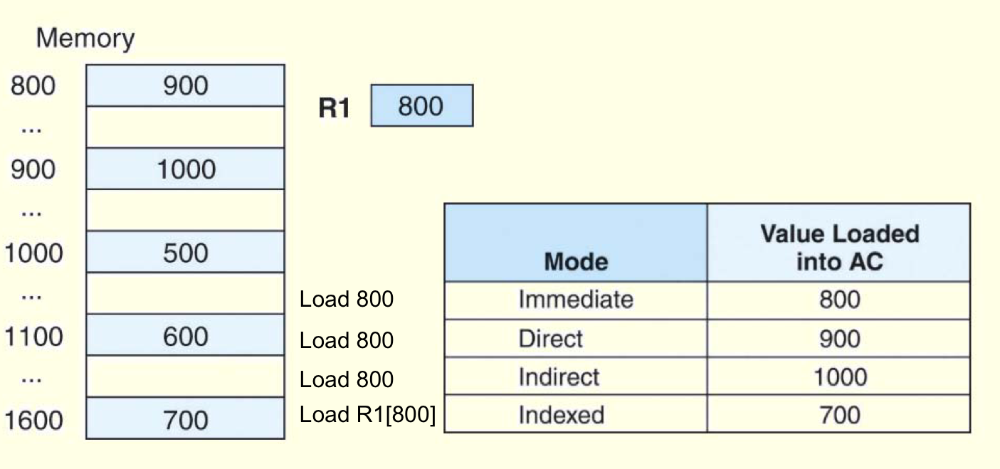
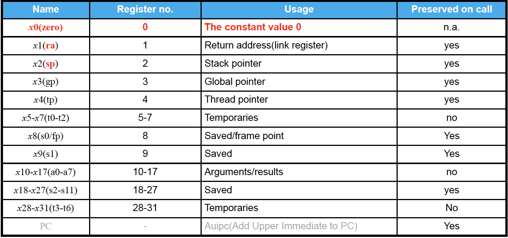
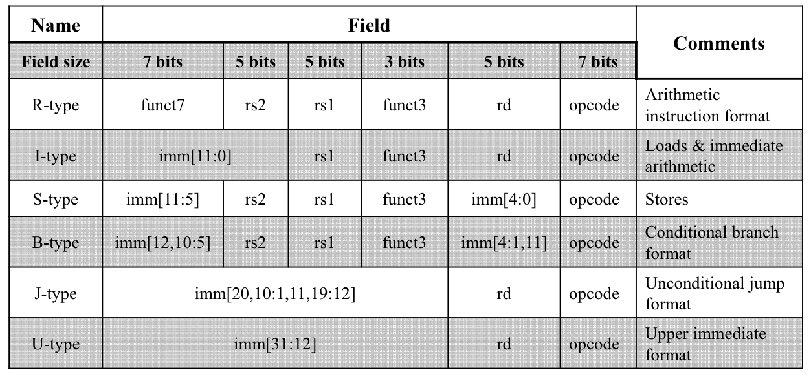

## ISA
### Introduction

- Instruction=opcode+operands（操作码+操作数）
    - 操作数一般为0/1/2/3

- 指令设计的基本原则
    1. Simplicity favors regularity
    2. Make the common case fast
    3. Smaller is faster
    4. Good design demands good compromises

### ISA Design

1. 不同操作数下同一指令的表示
    - 没有操作数的指令类似于栈的操作
    - 操作数越少，指令序列越长

2. 寻址模式
    - 立即数寻址
        - 直接包含需要处理的数据
        - e.g. ADD #5
    - 直接寻址
        - 操作数包含数据的地址
        - e.g. ADD 100
    - 不直接寻址
        - 操作数包含数据的地址的地址
        - 寻找范围更大
        - e.g. ADD \[100\]
    - 寄存器寻址
        - 直接寻址  
            - 寄存器中直接存储数据
            - e.g. ADD R5
        - 不直接寻址
            - 寄存器中存储数据的地址
            - e.g. ADD \[R5\]
    - 其余寻址模式
        - Indexed 寻址

    !!! note "Example"
        

### Classification 分类
1. CISC：复杂指令集
    - 代码更短
    - 编译更简单
2. RISC：精简指令集

## RISC-V
### 指令集分类
- **基础指令集**
    - **I**：整数指令
        
        |名称|功能|
        | :--: | :--: |
        |RV32I| 32 位基础整数指令集，32 个寄存器|
        |RV32E| 32 位基础指令集，16 个寄存器，用于极低端嵌入式应用|
        |RV64I| 64 位基础指令集，64 位寄存器，含 64 位数据加载/存储指令|

- **标准扩展**
    - **M**：整数乘除指令
    - **A**：原子指令
    - **F**：单精度浮点指令
    - **D**：双精度浮点指令
    - **C**：16 位压缩指令
    - **G = IMAFD**：整数基础指令集 + 四个标准扩展指令集
- **可选扩展**


### 寄存器
- 程序计数器（PC）
- 浮点状态寄存器（fsr）：用于浮点舍入模式以及异常报告
    
    ??? note "fsr的功能详述"
        1. 浮点舍入模式控制
           
        - **就近舍入（Round to Nearest）**：将数值舍入到最接近的可表示值。若出现中间值，例如 2.5，就会舍入到偶数，也就是 2.0。
        - **向上舍入（Round Up）**：把数值朝正无穷大的方向舍入，比如 2.1 会舍入为 3.0。
        - **向下舍入（Round Down）**：将数值朝负无穷大的方向舍入，例如 -2.9 会舍入为 -3.0。
        - **向零舍入（Round toward Zero）**：直接截断小数部分，只保留整数部分，像 2.9 会舍入为 2.0，-2.9 会舍入为 -2.0。

        2. 异常报告功能
           
        - **上溢（Overflow）**：当运算结果超出了浮点数所能表示的范围，例如 1e400（假设为双精度浮点数），就会发生上溢。
        - **下溢（Underflow）**：运算结果过小，无法用浮点数精确表示时，如下溢情况。
        - **除以零（Division by Zero）**：当进行除法运算时，除数为零，比如 1.0 / 0.0，就会触发该异常。
        - **无效操作（Invalid Operation）**：进行一些未定义的运算，例如对负数开平方，即 sqrt(-1)，会引发无效操作异常。
        - **不精确（Inexact）**：运算结果无法精确表示，需要进行舍入时，就会出现不精确的情况，如 1.0 / 3.0。


- 整数寄存器（32/64 bit）
    - 32个（x0~x31）
    - x0只能存储0
- 浮点数寄存器（单/双精度）
    - 32个（f0~f31）

|寄存器|ABI 名称|用途描述|saver|
|:--:|:--:|:--|:--:|
|x0|zero|硬件 0||
|x1|ra|返回地址（return address）|caller|
|x2|sp|栈指针（stack pointer）|callee|
|x3|gp|全局指针（global pointer）||
|x4|tp|线程指针（thread pointer）||
|x5|t0|临时变量/备用链接寄存器（alternate link reg）|caller|
|x6-7|t1-2|临时变量|caller|
|x8|s0/fp|需要保存的寄存器/帧指针（frame pointer）|callee|
|x9|s1|需要保存的寄存器|callee|
|x10-11|a0-1|函数参数/返回值|caller|
|x12-17|a2-7|函数参数|caller|
|x18-27|s2-11|需要保存的寄存器|callee|
|x28-31|t3-6|临时变量|caller|

??? note "不同寄存器的功能"
    

### 基础整数指令集RV32I
- 分类
    - 按照功能分类
        - ALU 指令
            - e.g. add,sub,addi...
        - Load/Store 指令
            - e.g. ld,lw,lh,sw,sd,fld...
        - Branch/Jump 指令
            - e.g. jal(跳转),jalr,beq(比较)...
    - 按照编码格式分类
        - R,I,S,B,U,J
        - opcode占右边的7位，表示指令是什么类型
        
        
        
=== "**R-type**"

    <table class="riscv-table">
    <tr>
        <td class="riscv-table-numnodel">31</td>
        <td class="riscv-table-numnode" colspan="5"></td>
        <td class="riscv-table-numnoder">25</td>
        <td class="riscv-table-numnodel">24</td>
        <td class="riscv-table-numnode" colspan="3"></td>
        <td class="riscv-table-numnoder">20</td>
        <td class="riscv-table-numnodel">19</td>
        <td class="riscv-table-numnode" colspan="3"></td>
        <td class="riscv-table-numnoder">15</td>
        <td class="riscv-table-numnodel">14</td>
        <td class="riscv-table-numnode" colspan="1"></td>
        <td class="riscv-table-numnoder">12</td>
        <td class="riscv-table-numnodel">11</td>
        <td class="riscv-table-numnode" colspan="3"></td>
        <td class="riscv-table-numnoder">7</td>
        <td class="riscv-table-numnodel">6</td>
        <td class="riscv-table-numnode" colspan="5"></td>
        <td class="riscv-table-numnoder">0</td>
    </tr>
    <tr>
        <td colspan="7" class="riscv-table-node">funct7</td>
        <td colspan="5" class="riscv-table-node">rs2</td>
        <td colspan="5" class="riscv-table-node">rs1</td>
        <td colspan="3" class="riscv-table-node">funct3</td>
        <td colspan="5" class="riscv-table-node">rd</td>
        <td colspan="7" class="riscv-table-node">opcode</td>
    </tr>
    </table>

    - rd = rs1 op rs2
    - 没有not运算符，通过xor实现

=== "**I-type**"
    
    <table class="riscv-table">
    <tr>
        <td class="riscv-table-numnodel">31</td>
        <td class="riscv-table-numnode" colspan="10"></td>
        <td class="riscv-table-numnoder">20</td>
        <td class="riscv-table-numnodel">19</td>
        <td class="riscv-table-numnode" colspan="3"></td>
        <td class="riscv-table-numnoder">15</td>
        <td class="riscv-table-numnodel">14</td>
        <td class="riscv-table-numnode" colspan="1"></td>
        <td class="riscv-table-numnoder">12</td>
        <td class="riscv-table-numnodel">11</td>
        <td class="riscv-table-numnode" colspan="3"></td>
        <td class="riscv-table-numnoder">7</td>
        <td class="riscv-table-numnodel">6</td>
        <td class="riscv-table-numnode" colspan="5"></td>
        <td class="riscv-table-numnoder">0</td>
    </tr>
    <tr>
        <td colspan="12" class="riscv-table-node">imm[11:0]</td>
        <td colspan="5" class="riscv-table-node">rs1</td>
        <td colspan="3" class="riscv-table-node">funct3</td>
        <td colspan="5" class="riscv-table-node">rd</td>
        <td colspan="7" class="riscv-table-node">opcode</td>
    </tr>
    </table>
    
    - 立即数指令（立即数是有符号数）
    - 如果是 ALU 运算，则 `rd = rs1 op imm`
    - 如果是 Load 指令，`rd`表示目标寄存器，`[rs1]+imm`表示内存地址
    - e.g. Load指令

=== "**S-type**"
    
    <table class="riscv-table">
    <tr>
        <td class="riscv-table-numnodel">31</td>
        <td class="riscv-table-numnode" colspan="5"></td>
        <td class="riscv-table-numnoder">25</td>
        <td class="riscv-table-numnodel">24</td>
        <td class="riscv-table-numnode" colspan="3"></td>
        <td class="riscv-table-numnoder">20</td>
        <td class="riscv-table-numnodel">19</td>
        <td class="riscv-table-numnode" colspan="3"></td>
        <td class="riscv-table-numnoder">15</td>
        <td class="riscv-table-numnodel">14</td>
        <td class="riscv-table-numnode" colspan="1"></td>
        <td class="riscv-table-numnoder">12</td>
        <td class="riscv-table-numnodel">11</td>
        <td class="riscv-table-numnode" colspan="3"></td>
        <td class="riscv-table-numnoder">7</td>
        <td class="riscv-table-numnodel">6</td>
        <td class="riscv-table-numnode" colspan="5"></td>
        <td class="riscv-table-numnoder">0</td>
    </tr>
    <tr>
        <td colspan="7" class="riscv-table-node">imm[11:5]</td>
        <td colspan="5" class="riscv-table-node">rs2</td>
        <td colspan="5" class="riscv-table-node">rs1</td>
        <td colspan="3" class="riscv-table-node">funct3</td>
        <td colspan="5" class="riscv-table-node">imm[4:0]</td>
        <td colspan="7" class="riscv-table-node">opcode</td>
    </tr>
    </table>
    
    - `rs1`：存放内存地址的基址
    - `rs2`：存放数据
    - `imm`：地址的偏移量
    
    !!! note "Notice!"
        - RISC-V的数据存储模式为小端模式（little endian）：数据的高字节储存在高地址
        - PowerPC使用大端模式

=== "**B-type**"

    <table class="riscv-table">
    <tr>
        <td class="riscv-table-numnodel">31</td>
        <td class="riscv-table-numnode" colspan="5"></td>
        <td class="riscv-table-numnoder">25</td>
        <td class="riscv-table-numnodel">24</td>
        <td class="riscv-table-numnode" colspan="3"></td>
        <td class="riscv-table-numnoder">20</td>
        <td class="riscv-table-numnodel">19</td>
        <td class="riscv-table-numnode" colspan="3"></td>
        <td class="riscv-table-numnoder">15</td>
        <td class="riscv-table-numnodel">14</td>
        <td class="riscv-table-numnode" colspan="1"></td>
        <td class="riscv-table-numnoder">12</td>
        <td class="riscv-table-numnodel">11</td>
        <td class="riscv-table-numnode" colspan="3"></td>
        <td class="riscv-table-numnoder">7</td>
        <td class="riscv-table-numnodel">6</td>
        <td class="riscv-table-numnode" colspan="5"></td>
        <td class="riscv-table-numnoder">0</td>
    </tr>
    <tr>
        <td colspan="7" class="riscv-table-node">imm[12,10:5]</td>
        <td colspan="5" class="riscv-table-node">rs2</td>
        <td colspan="5" class="riscv-table-node">rs1</td>
        <td colspan="3" class="riscv-table-node">funct3</td>
        <td colspan="5" class="riscv-table-node">imm[4:1,11]</td>
        <td colspan="7" class="riscv-table-node">opcode</td>
    </tr>
    </table>

=== "**U-type**"

    <table class="riscv-table">
    <tr>
        <td class="riscv-table-numnodel">31</td>
        <td class="riscv-table-numnode" colspan="18"></td>
        <td class="riscv-table-numnoder">12</td>
        <td class="riscv-table-numnodel">11</td>
        <td class="riscv-table-numnode" colspan="3"></td>
        <td class="riscv-table-numnoder">7</td>
        <td class="riscv-table-numnodel">6</td>
        <td class="riscv-table-numnode" colspan="5"></td>
        <td class="riscv-table-numnoder">0</td>
    </tr>
    <tr>
        <td colspan="20" class="riscv-table-node">imm[31:12]</td>
        <td colspan="5" class="riscv-table-node">rd</td>
        <td colspan="7" class="riscv-table-node">opcode</td>
    </tr>
    </table>
 
    - LUI: load upper immediate
    - AUIPC: add upper immediate to PC

=== "**J-type**"
    
    <table class="riscv-table">
    <tr>
        <td class="riscv-table-numnodel">31</td>
        <td class="riscv-table-numnode" colspan="18"></td>
        <td class="riscv-table-numnoder">12</td>
        <td class="riscv-table-numnodel">11</td>
        <td class="riscv-table-numnode" colspan="3"></td>
        <td class="riscv-table-numnoder">7</td>
        <td class="riscv-table-numnodel">6</td>
        <td class="riscv-table-numnode" colspan="5"></td>
        <td class="riscv-table-numnoder">0</td>
    </tr>
    <tr>
        <td colspan="20" class="riscv-table-node">imm[20,10:1,11,19:12]</td>
        <td colspan="5" class="riscv-table-node">rd</td>
        <td colspan="7" class="riscv-table-node">opcode</td>
    </tr>
    </table>
        

!!! note "NOP"
    - 表示空指令，没有操作
    - e.g. ADDI x0,x0,0;

### 根据opcode判断指令类型

| 指令类型 | 操作码（二进制） | 操作码（十六进制） | 典型指令         |
|----------|------------------|--------------------|------------------|
| R型      | `0110011`        | 0x33               | `add`, `sub`, `mul` |
| I型（算术） | `0010011`      | 0x13               | `addi`, `slli`, `xori` |
| I型（加载） | `0000011`       | 0x03               | `lb`, `lw`, `ld` |
| I型（跳转） | `1100111`       | 0x67               | `jalr`(唯一)      |
| S型（存储） | `0100011`       | 0x23               | `sb`, `sw`, `sd` |
| B型（分支） | `1100011`       | 0x63               | `beq`, `bne`, `blt` |
| U型      | `0110111`        | 0x37               | `lui`            |
| J型      | `1101111`        | 0x6F               | `jal`            |

??? note "RISC-V指令编码总结"
    | 指令格式 | 指令名称 | 操作码（二进制） | funct3（二进制） | funct6/7（二进制） | 功能简述 |
    | ---- | ---- | ---- | ---- | ---- | ---- |
    | R - type | add | 0110011 | 000 | 0000000 | 寄存器加法  |
    |  | sub | 0110011 | 000 | 0100000 | 寄存器减法  |
    |  | sll | 0110011 | 001 | 0000000 | 逻辑左移  |
    |  | xor | 0110011 | 100 | 0000000 | 按位异或  |
    |  | srl | 0110011 | 101 | 0000000 | 逻辑右移  |
    |  | sra | 0110011 | 101 | 0100000 | 算术右移  |
    |  | or | 0110011 | 110 | 0000000 | 按位或  |
    |  | and | 0110011 | 111 | 0000000 | 按位与  |
    |  | lr.d | 0110011 | 011 | 0001000 | 加载双字并保留（特定功能 ） |
    |  | sc.d | 0110011 | 011 | 0001100 | 存储双字并检查（特定功能 ） |
    | I - type | lb | 0000011 | 000 | n.a. | 加载字节  |
    |  | lh | 0000011 | 001 | n.a. | 加载半字  |
    |  | lw | 0000011 | 010 | n.a. | 加载字  |
    |  | ld | 0000011 | 011 | n.a. | 加载双字  |
    |  | lbu | 0000011 | 100 | n.a. | 加载无符号字节  |
    |  | lhu | 0000011 | 101 | n.a. | 加载无符号半字  |
    |  | lwu | 0000011 | 110 | n.a. | 加载无符号字  |
    |  | addi | 0010011 | 000 | n.a. | 立即数加法  |
    |  | slli | 0010011 | 001 | 0000000 | 立即数逻辑左移  |
    |  | xori | 0010011 | 100 | n.a. | 立即数按位异或  |
    |  | srli | 0010011 | 101 | 0000000 | 立即数逻辑右移  |
    |  | srai | 0010011 | 101 | 0100000 | 立即数算术右移  |
    |  | ori | 0010011 | 110 | n.a. | 立即数按位或  |
    |  | andi | 0010011 | 111 | n.a. | 立即数按位与  |
    |  | jalr | 1100111 | 000 | n.a. | 寄存器跳转并链接  |
    | S - type | sb | 0100011 | 000 | n.a. | 存储字节  |
    |  | sh | 0100011 | 001 | n.a. | 存储半字  |
    |  | sw | 0100011 | 010 | n.a. | 存储字  |
    |  | sd | 0100011 | 111 | n.a. | 存储双字  |
    | B - type | beq | 1100011 | 000 | n.a. | 相等则分支  |
    |  | bne | 1100011 | 001 | n.a. | 不相等则分支  |
    |  | blt | 1100011 | 100 | n.a. | 小于则分支  |
    |  | bge | 1100011 | 101 | n.a. | 大于等于则分支  |
    |  | bltu | 1100011 | 110 | n.a. | 无符号小于则分支  |
    |  | bgeu | 1100011 | 111 | n.a. | 无符号大于等于则分支  |
    | U - type | lui | 0110111 | n.a. | n.a. | 加载立即数高位  |
    | J - type | jal | 1101111 | n.a. | n.a. | 跳转并链接  | 


## 汇编语言
### 函数调用
**1. 核心步骤**

- **传参**  
    - 前8个参数 → `a0-a7`
    - 超出的压栈（`sp`向低地址增长）：通过调整栈指针（sp）来实现
        e.g. `addi sp,sp,-framesize` 
   
    ```asm
    sd a8, -8(sp)   # 第9个参数存栈
    ```

- **跳转**  
    - `jal ra, func`：跳转并保存返回地址到 `ra`（`x1`）

- **执行**  
    - 使用栈空间存储局部变量和临时数据

- **返回调用点**  
    - 结果存 `a0`，恢复寄存器，释放栈帧，`ret` 返回

**2. 函数序言（Prologue）**（函数开始部分，为函数执行做准备）

```asm
func:
    addi sp, sp, -16   # 分配栈帧（假设需16字节）
    sd   ra, 8(sp)     # 保存返回地址
    sd   s0, 0(sp)     # 保存被调用者保存寄存器
    addi s0, sp, 16    # 设置帧指针（可选）
```

**作用**：
  
- 保护 `ra` 和关键寄存器  
- 建立栈帧（局部变量通过 `sp` 或 `s0` 访问）


**3. 函数尾声（Epilogue）**（函数执行结束时运行，恢复函数调用前的环境并返回）

```asm
ld   ra, 8(sp)     # 恢复返回地址
ld   s0, 0(sp)     # 恢复寄存器
addi sp, sp, 16    # 释放栈帧
ret                # 返回（等价于 jalr x0, 0(ra)）
```

**4. 关键规则**

- **调用者保存**（Caller-Saved）：`a0-a7`, `t0-t6`（若需保留，调用前压栈）  
- **被调用者保存**（Callee-Saved）：`ra`, `s0-s11`, `sp`（函数内若使用，必须保存）  

??? note "叶子函数与非叶子函数"
    - 叶子函数：不调用其他任何函数的函数
        - 无需保存返回地址`ra`
    - 非叶子函数：调用其他函数的函数
        - 必须保存返回地址`ra`

**5. 过程调用指令**

```asm
//jump and link
jal x1,ProcedureLabel    //返回地址保存在x1中
//jump and link register
jalr x0,0(x1)         //跳转到x1储存的返回地址，x0是为了满足指令格式需求
```

**6. Example**

=== "递归求阶乘"

    ```c
    long long fact ( long long n ){
        if ( n<1 ) return 1;
        else return n * fact(n-1);
    }
    ```

    ```asm
    fact:
        addi sp, sp, -16       # 分配栈帧
        sd   ra, 8(sp)         # 保存ra
        sd   a0, 0(sp)         # 保存参数n
        addi t0, a0, -1        # t0 = n-1
        bge  t0, zero, L1      # if n>=1, goto L1
        addi a0, zero, 1       # 基线条件：return 1
        addi sp, sp, 16        # 释放栈帧
        ret                    # 返回
    L1:
        addi a0, a0, -1        # n = n-1
        jal  ra, fact          # 递归调用fact(n-1)
        ld   t1, 0(sp)         # 恢复原始n值
        mul  a0, t1, a0        # return n * fact(n-1)
        ld   ra, 8(sp)         # 恢复ra
        addi sp, sp, 16        # 释放栈帧
        ret
    ```

=== "switch跳转表"

    ```c
    int switch_eg(long long x, long long y) {
        long long result = y;
        switch (x) {
        case 20:
            result = result - 5;
        case 21:
            result = result + 19;
            break;
        case 22:
            result += 11;
            break;
        case 24:
        case 26:
            result -= 20;
            break;
        default:
            result = 0;
        }
        return result;
    }
    ```

    ```asm
    	.text
	    .globl	switch_eg
    switch_eg:
        addi	a5,a0,-20 # 计算偏移量，x 的最小case值是20
        li	a4,6   # 跳转表的最大索引为6，共七个值
        bgtu	a5,a4,.L8  # 如果a5>6，跳转到.L8（default）
        # 无符号跳转，负数的时候也会跳转（因为无符号的时候负数是一个很大的数）
        lla	a4,.L4      # 取跳转表基地址
        slli	a5,a5,2   # 乘4
        add	a5,a5,a4   # 计算目标条目（储存地址偏移量）地址
        lw	a5,0(a5)   # 加载跳转表中的偏移量
        add	a5,a5,a4   # 计算目标地址
        jr	a5
        .section	.rodata  # 只读数据段
        .align	2   # 4字节对齐
        .align	2	
    .L4:     # 跳转表
        .word	.L7-.L4   # 偏移量
        .word	.L6-.L4
        .word	.L5-.L4
        .word	.L8-.L4
        .word	.L3-.L4
        .word	.L8-.L4
        .word	.L3-.L4
        .text
    .L3:
        addiw	a0,a1,-20
        ret
    .L7:
        addi	a1,a1,-5
    .L6:
        addiw	a0,a1,19
        ret
    .L5:
        addiw	a0,a1,11
        ret
    .L8:
        li	a0,0
        ret
    ```

### stack
- push/pop
- 两种寄存器
    - temporary：由主函数负责，不需要压栈
    - saved：由被调用函数负责，需要压栈  

### 程序运行
- preprocessor(\*.c->\*.i):宏展开
- complier(\*.i->\*.s):生成汇编文件
- assembler(\*.s->\*.o):生成目标文件
- linker(\*.o->\*.out):生成可执行文件
