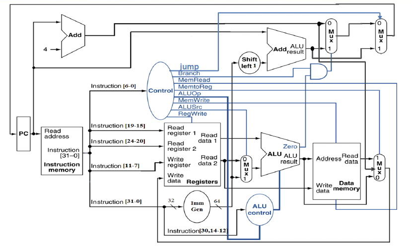

## 计算机体系结构
- 计算机体系结构
    
    |Computer Architecture|
    |:--:|
    |problem|
    |algorithm|
    |program|
    |**runtime systerm (VM,OS,MM)**|
    |**ISA (architecture)**|
    |**microarchitecture**|
    |logic|
    |circuits|
    |electrons|

!!! note "Notice!"
    - VM（ 虚拟机，Virtual Machine ）
    - OS（ 操作系统，Operating System ）
    - MM（ 内存管理，Memory Management ） 

- 冯诺伊曼架构

\[
\text{Computer}
\begin{cases}
    \text{CPU} & 
        \begin{cases}
            \text{Control unit} \\
            \text{Datapath} & 
                \begin{cases}
                    \text{Path: multiplexors} \\
                    \text{ALU} \\
                    \text{Registers} \\
                    \text{……}
                \end{cases}
        \end{cases} \\
    \text{Memory} \\
    \text{I/O interface}
\end{cases}
\]

## CPU
### 核心组成部分
- 数据通路：对数据执行操作
- 控制单元：对数据通路、内存等进行时序控制
- 高速缓存（cache memory）：一种小型快速的静态随机存取存储器（SRAM），用于快速访问数据
### 数据通路（Datapath）
- ALU

    |Operation|Function|
    |:--:|:--:|
    |000|And|
    |001|Or|
    |010|Add|
    |110|Sub|
    |111|Sit(比较)|

- Memory（存储器）
    - 指令存储器
        - 只读
        - 输入指令地址，输出相应指令
    - 数据存储器
        - 读写
        - 由`MemRead`和`MemWrite`控制
- register files（寄存器堆）
    - 由32个64 bit的寄存器组成
    - 由D触发器实现
    - 输入/输出
        - 输入：两个5 bit的寄存器编号/一个5 bit的寄存器编号和一个64 bit的数据
        - 输出：64 bit的数据

    ```verilog
    Module regs( 
        input clk, rst, RegWrite,
        input [4:0] Rs1_addr, Rs2_addr, Wt_addr,
        input [63:0] Wt_data,
        output [63:0] Rs1_data, Rs2_data
    );
    reg [63:0] register [1:31];        // r1 - r31
    integer i;

    assign rdata_A = (Rs1_addr== 0)? 0 : register[Rs1_addr];        // read
    assign rdata_B = (Rs2_addr== 0)? 0 : register[Rs2_addr];        // read

    always @(posedge clk or posedge rst)
    begin 
        if (rst==1)
            for (i=1; i<32; i=i+1) register[i] <= 0;        // reset
        else if ((Wt_addr != 0) && (RegWrite == 1))
            register[Wt_addr] <= Wt_data;        // write
    end
    endmodule 
    ```

- others：立即数生成单元
    - 功能：
        - 从指令中提取立即数
        - 符号扩展
        - 位移操作

### 性能（performance）
- 相关定义
    - 响应时间（Latency）：任务从开始到完成的总时间（如程序运行时间）
    - 吞吐量（Throughput）：单位时间内完成的任务量（如每秒处理的事务数）

        !!! note "Problem"
            - 替换更快的处理器：响应时间下降，吞吐量可能上升（若任务独立）
            - 增加处理器数量：吞吐量上升（并行处理），但单任务响应时间可能不变
    
    - CPU时间 **（用来衡量性能）**  = 用户CPU时间 + 系统CPU时间
    - 时钟周期（Clock Period）：单个周期持续时间
    - 时钟频率（Clock Rate）：每秒周期数

- 公式
    - $Performance=\frac{1}{Execution Time(执行时间)}$

        - X is $n$ time faster than Y.

            $$
            \frac{Performance_X}{Performance_Y}=\frac{Execution Time_Y}{Execution Time_X}=n
            $$

    - $CPU Time= Clock Cycles \times Clock Period = \frac{Clock Cycles}{Clock Rate}$

- 性能提高的方式
    - 减少时钟周期数
    - 提高时钟频率
    - 硬件设计师常常需要在时钟频率和时钟周期数之间进行权衡 

### CPI（每条指令的平均周期数）
- 特点
    - 由CPU硬件决定
    - 不同指令可能有不同的CPI
    - 平均CPI受指令组合的影响
- 公式
    
    $$
    CPI = \frac{CPU \ Clock \ Cycles}{Instruction \ Count}
    $$

- 重要公式：
    
    $CPU \ Clock \ Cycles = Instructions \ for \ a \ Program \times Average \ Clock \ Cycles \ Per \ Instruction$
    
    $CPU \ Time = Instruction \ Count \times CPI \times Clock \ Period$
    
    $CPU \ Time = \frac{Instruction \ Count \times CPI}{Clock \ Rate}$
    
    - 当不同指令类别执行所需的时钟周期数不同时，总时钟周期数（Clock Cycles）的计算方法为：
        
        \[ Clock \ Cycles = \sum_{i = 1}^{n} (CPI_{i} \times Instruction \ Count_{i}) \]

    - 加权平均CPI的计算公式为：
        
        \[ CPI = \frac{Clock \ Cycles}{Instruction \ Count} = \sum_{i = 1}^{n} \left( CPI_{i} \times \frac{Instruction \ Count_{i}}{Instruction \ Count} \right) \]

## CPU design

### 数据通路
1. 数据通路基本元素

- 寄存器组（Registers）
    - 32 个 64 位寄存器（x0-x31）
    - 两个读端口和一个写端口
    - 写操作由时钟边沿触发，受RegWrite信号控制
- 算术逻辑单元（ALU）
    - 加法（Add）、减法（Sub）、与（And）、或（Or）、小于置位（Slt）等操作
    - 由ALU Op1和ALU Op0两位信号控制
    - 输入：两个操作数（来源由ALUSrc信号决定：寄存器数据或立即数）
    - 输出：结果及标志位（如 Zero）
- 存储器（Memory）
    - 指令存储器（Instruction Memory）：只读，按地址读取指令
    - 数据存储器（Data Memory）：读写由MemRead和MemWrite信号控制，支持按地址存取数据
- 立即数生成单元（Immediate Generation Unit）
    - 根据指令类型生成对应立即数，并进行符号扩展至 64 位


### 控制器
1. 控制信号

- ALU op

|指令|ALU op|
|:--:|:--:|
|ld|00|
|sd|00|
|beq|01|
|R-type|10|

| 信号名称 | 无效时（=0）| 有效时（=1） |
|:--:|:--:|:--:|
| RegWrite | 无 | 寄存器写入 |
| ALUScr | ALU的第二个操作数来自第二个寄存器文件输出（读数据2） | ALU的第二个操作数来自立即数生成器 |
| Branch（PCSrc） | PC=PC+4 | PC跳转至分支目标地址（PC+立即数） |
| Jump | PC=PC+4或分支目标 | PC跳转至跳转地址 |
| MemRead | 无 | 读取数据存储器内容 |
| MemWrite | 无 | 将数据写入数据存储器 |
| MemtoReg（2位） | 00：写入寄存器的数据来自ALU | 写入寄存器的数据来自<br>01：数据存储器<br>10：PC+4<br>11：立即数生成器的输出 | 

1. 控制信号生成

- 主译码器（Main Decoder）
    - 输入：7位操作码（Opcode）
    - 输出：7个控制信号和2位ALU Op信号
- ALU 译码器（ALU Decoder）
    - 输入：ALU Op和指令中的funct3、funct7
    -  输出：具体ALU操作

3. 主指令译码器真值表

<table>
  <thead>
    <tr>
      <th colspan="2">输入</th>
      <th colspan="9">输出</th>
    </tr>
    <tr>
      <th>Instruction</th>
      <th>OPCode</th>
      <th>ALUSrcB</th>
      <th>Memto-Reg</th>
      <th>Reg Write</th>
      <th>Mem Read</th>
      <th>Mem Write</th>
      <th>Branch</th>
      <th>Jump</th>
      <th>ALU Op1</th>
      <th>ALU Op0</th>
    </tr>
  </thead>
  <tbody>
    <tr>
      <td>R-format</td>
      <td>0110011</td>
      <td>0</td>
      <td>00</td>
      <td>1</td>
      <td>0</td>
      <td>0</td>
      <td>0</td>
      <td>0</td>
      <td>1</td>
      <td>0</td>
    </tr>
    <tr>
      <td>Ld(I-Type)</td>
      <td>0000011</td>
      <td>1</td>
      <td>01</td>
      <td>1</td>
      <td>1</td>
      <td>0</td>
      <td>0</td>
      <td>0</td>
      <td>0</td>
      <td>0</td>
    </tr>
    <tr>
      <td>sd(S-Type)</td>
      <td>0100011</td>
      <td>1</td>
      <td>X</td>
      <td>0</td>
      <td>0</td>
      <td>1</td>
      <td>0</td>
      <td>0</td>
      <td>0</td>
      <td>0</td>
    </tr>
    <tr>
      <td>beq(SB-Type)</td>
      <td>1100111</td>
      <td>0</td>
      <td>X</td>
      <td>0</td>
      <td>0</td>
      <td>0</td>
      <td>1</td>
      <td>0</td>
      <td>0</td>
      <td>1</td>
    </tr>
    <tr>
      <td>Jal(UJ-Type)</td>
      <td>1101111</td>
      <td>X</td>
      <td>10</td>
      <td>1</td>
      <td>0</td>
      <td>0</td>
      <td>0</td>
      <td>1</td>
      <td>X</td>
      <td>X</td>
    </tr>
    <tr>
      <td>Jalr</td>
      <td>1100111</td>
      <td>1</td>
      <td>10</td>
      <td>1</td>
      <td>0</td>
      <td>0</td>
      <td>0</td>
      <td>0</td>
      <td>0</td>
      <td>0</td>
    </tr>
    <tr>
      <td>lui</td>
      <td>0110111</td>
      <td>X</td>
      <td>11</td>
      <td>1</td>
      <td>0</td>
      <td>0</td>
      <td>0</td>
      <td>0</td>
      <td>X</td>
      <td>X</td>
  </tbody>
</table>