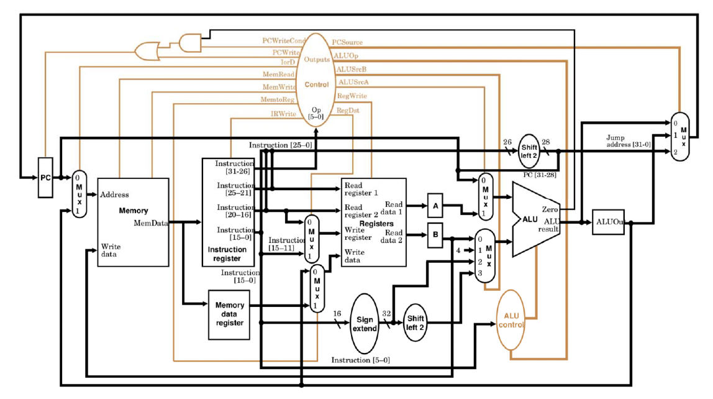

## 单周期与多周期CPU
### 单周期CPU
- 特点：
    - 所有指令在一个时钟周期内完成，CPI 恒为1
    - 设计简单
- 局限性：
    - 时钟周期受最长指令（如加载指令 lw）限制
    - 硬件资源利用率低（需两个加法器 / ALU 和两个存储器）
    - 无法优化不同指令的执行效率
### 多周期CPU
- 特点：
    - 指令执行分解为多个阶段（如取指、译码、执行等）
    - 每个阶段占用一个时钟周期，不同指令 CPI 不同（3-5 个周期），时钟周期更短
    - 可复用硬件资源（如仅需一个 ALU 和存储器）
- 局限性：
    - 需多次承担时序控制开销
    - 控制器设计复杂

## 多周期CPU设计

### 数据通路的新部件

- **临时寄存器**
    - IR（指令寄存器）：存储从存储器取出的指令
    - MDR（内存数据寄存器）：暂存从存储器读取的数据
    - A/B 寄存器：暂存从寄存器堆读取的操作数
    - ALUout：暂存 ALU 运算结果

### 指令执行的阶段

1. **取指（IF）**
    
- 从存储器读取指令
- PC=PC+4

2. **译码（ID）**
    
- 指令译码
- 读取寄存器数据
- 计算分支目标地址（Branch/Jump）

3. **执行（EX）**
    
- 根据指令类型执行
- e.g.
    - Memory-related:`ALUOut = A + sign - extend(IR[15 - 0])`
    - R-type:`ALUOut = A op B`
    - Branch:`if (A == B) PC = ALUOut` 满足分支条件，将程序计数器（PC）值更新为ALUOut中的分支目标地址
    - Jump:`PC=ALUout`

4. **访存（MEM）**

- 根据指令类型执行
- e.g.
    - Memory-related:
        - Load: `MDR = Memory[ALUOut]`
        - Store: `Memory[ALUOut] = B`
    - R-type: `Reg[IR[15 - 11]] = ALUOut`

5. **回写（WB）**
    
- 将结果写入寄存器堆
- Load: `Reg[IR[20 - 16]] = MDR`

### 控制器
1. **控制信号**
    
- 单比特信号
  
    | 信号名称 | 信号无效(0) | 信号有效(1) |
    | :--: | :--: | :--: |
    | RegDst   | 目标寄存器地址取自指令中的rt字段(20-16位) | 目标寄存器地址取自指令中的rd字段(15-11位) |
    | RegWrite | 无 | 将数据写入寄存器堆指定位置 |
    | ALUSrcA  | ALU的第一个操作数来自程序计数器(PC) | ALU的第一个操作数来自寄存器堆A |
    | MemRead  | 无 | 从内存指定地址读取数据 |
    | MemWrite | 无 | 将数据写入内存指定地址 |
    | MemToReg | 寄存器写入数据来自ALU运算结果(ALUOut) | 寄存器写入数据来自内存读取结果(MDR) |
    | IorD     | 使用PC作为内存访问地址 | 使用ALU运算结果(ALUOut)作为内存访问地址 |
    | IRWrite  | 无 | 将内存读取的指令写入指令寄存器 |
    | PCWrite  | 无 | 更新PC，来源由PCsrc信号选择 |
    | PCWriteCond | 无 | 当ALU输出为零时(Zero=1)更新PC |

- 双比特信号
  
    | 信号名称 | 编码值 | 功能 |
    | :--: | :--: | :--: |
    | ALUOp    | 00     | 控制ALU执行加法操作(用于PC递增、地址计算) |
    |          | 01     | 控制ALU执行减法操作(用于分支条件判断) |
    |          | 10     | 根据指令中的功能码(func字段)决定ALU操作类型 |
    | ALUSrcB  | 00     | ALU的第二个操作数来自寄存器堆B |
    |          | 01     | ALU的第二个操作数为常数4(用于PC+4计算) |
    |          | 10     | ALU的第二个操作数为指令低16位符号扩展后的值 |
    |          | 11     | ALU的第二个操作数为指令低16位符号扩展并左移2位后的值(用于分支地址计算) |
    | PCSrc    | 00     | PC更新为PC+4(顺序执行) |
    |          | 01     | PC更新值为分支目标地址(ALUOut，用于条件分支) |
    |          | 10     | PC更新值为跳转目标地址(指令高26位左移2位并拼接PC高4位) |

2. **控制器设计**
    
- 以 `add` 指令为例
- 取指

| 控制信号 | PCWrite | IorD | MemRead | MemWrite | IRWrite | PCSource | ALUOp | ALUSrcB | ALUSrcA | RegWrite |
| :--: | :--: | :--: | :--: | :--: | :--: | :--: | :--: |:--: | :--: |:--: | 
| 值 | 1 | 0 | 1 | 0 | 1 | 00 | 00 | 01| 0 | 0|

- 译码

| 控制信号 | ALUOp | ALUSrcB | ALUSrcA |
|:--: | :--: |:--: | :--: |
| 值 | 00| 11| 0 |

- 运算

| 控制信号 | ALUOp | ALUSrcB | ALUSrcA |
|:--: | :--: |:--: | :--: |
| 值 | 10| 00 | 1 |

- 写回

| 控制信号 | MemtoReg | RegWrite | RegDst |
|:--: | :--: |:--: | :--: |
| 值 | 0 | 1  | 1 |

3. **控制器分类**
    
- Hardwired Controller（硬布线控制器）
    - 适用于RISC
    - 原理：基于有限状态机（FSM），通过组合逻辑（如 PLA 电路）生成控制信号，每个状态对应指令执行的一个阶段
    - 优点：控制信号生成快
    - 缺点：ISA复杂时难以维护，需重新设计硬件逻辑
- Micro-program Controller（微程序控制器）
    - 适用于CISC
    - 原理：
        - 将指令分解为微指令序列，存储于控制存储器（CS），每条微指令对应一个微操作（如寄存器写、ALU 运算）
        - 微指令包含微命令（如RegWrite=1）和下一条微指令地址，通过微程序计数器（μPC）顺序执行
    - 优点：设计灵活，易于修改指令集
    - 缺点：执行速度较慢（需额外周期读取微指令），效率低于硬布线控制器

### 性能分析
1. **各指令周期数**

- 分支/跳转指令（beq/j）：3周期
- R型指令（add）/存储指令（sw）：4周期
- 加载指令（lw）：5周期