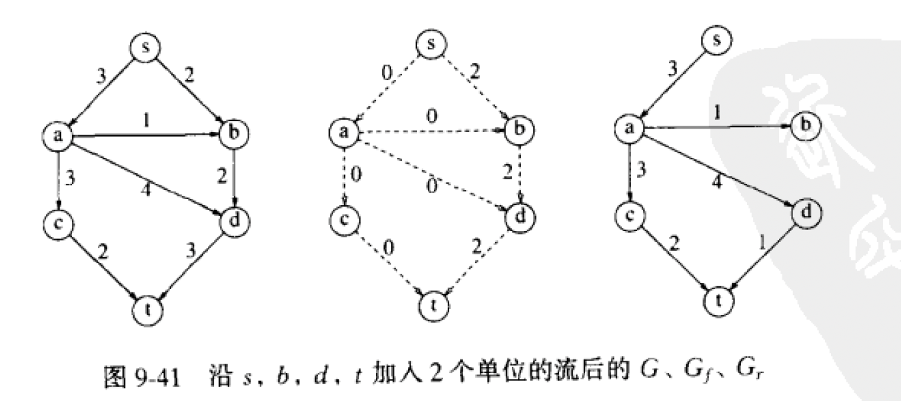
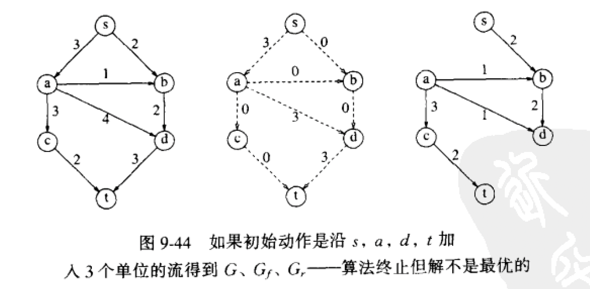
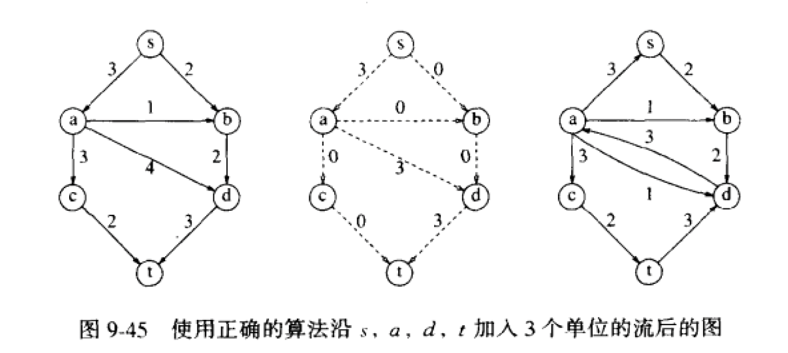
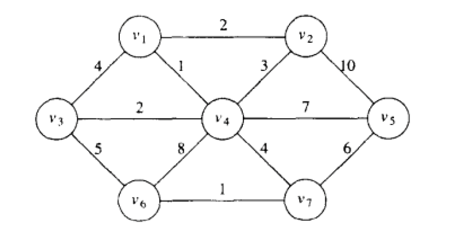
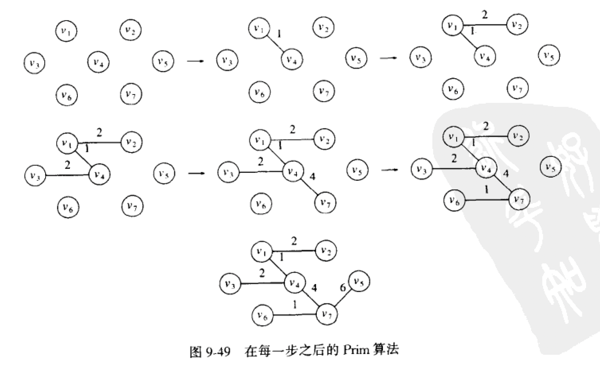
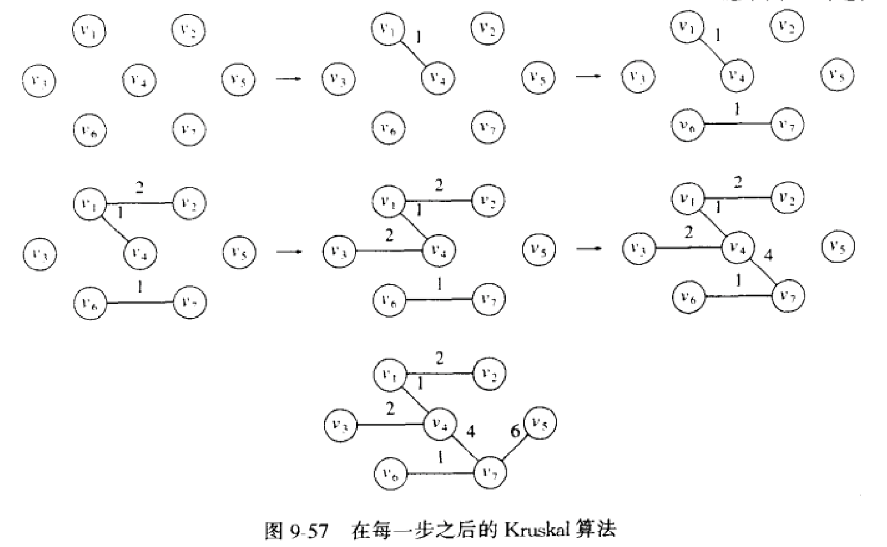
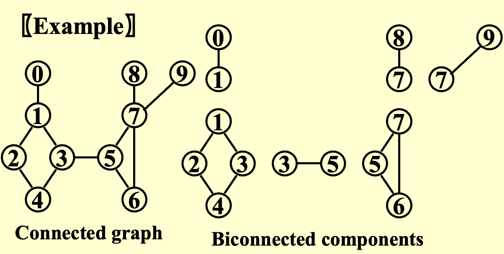

!!! note "Notice!"
    以下代码均为伪代码！


### 9.3 最短路径算法（Shortest Path Algorithms）
#### 9.3.1 无权最短路径（Unweighted Shortest Paths）
- 方法一：
    - 变量含义：

        T\[V\].Known：如果是1，表示已经被检查过；如果是零，则未被检查过

        T\[W\].Dist：表示从源点$s$到当前节点的距离

        T\[W\].Path：用于追踪路径，记录当前节点在最短路径中的上一个节点

    - 时间复杂度：$O(|V|^2)$

    ```c
    void Unweighted(Table T ){   /* Assume T is initialized */
        int CurrDist;  //表示到源点s的距离
        Vertex V, W;
        for( CurrDist = 0; CurrDist < NumVertex; CurrDist++ ) 
            for each vertex V
                if( (!T[V].Known && T[V].Dist == CurrDist ) ){  //未被检查过并且属于当前层级
                    T[V].Known = True;   //表示已经检查过
                    for each W adjacent to V      //V的下一个节点
                        if( T[W].Dist == Infinity ){
                            T[W].Dist = CurrDist + 1;  //距离赋值
                            T[W].Path = V;    //记住上一个节点
                        }
                }
    }
    ```
 
- 方法二（improvement）：
    - 思路：利用队列
    - 时间复杂度：$O(|V|+|E|)$
        - 每个节点最多入队一次
        - 对每个节点寻找下一个邻接的节点，每个边最多遍历一次，时间复杂度为$O(|E|)$

    ```c
    void Unweighted( Table T ){    /* Assume T is initialized */
        Queue Q;
        Vertex V, W;
        Q = CreateQueue( NumVertex );   //利用节点的个数创建队列
        MakeEmpty( Q ); 
        Enqueue( S, Q );   //源点s入队
        while( !IsEmpty( Q ) ){
            V = Dequeue( Q );   //队列第一个节点出队
            T[V].Known = True;    //表示已经被检查过
            for each W adjacent to V
                if( T[W].Dist == Infinity ){
                    T[W].Dist = T[V].Dist + 1;
                    T[W].Path = V;
                    Enqueue( W, Q );    //V的下一个节点入队
                }
        }
        DisposeQueue( Q );
    }
    ```

#### 9.3.2 Dijkstra算法（weighted shortest paths）
- 适用于稠密图
    - 时间复杂度：$O(|V|^2+|E|)$
        - 寻找最小的不知道距离的节点时间复杂度为$O(|V|)$
        - 且每个节点都需要寻找一次，总的时间复杂度$O(|V|^2)$
        - 对每个节点寻找下一个邻接的节点，每个边最多遍历一次，时间复杂度为$O(|E|)$

    ```c
    void Dijkstra( Table T ){
        Vertex V, W;
        for( ; ; ){
            V = smallest unknown distance vertex;   //V表示最小的不知道距离的节点
            if( V == NotAVertex )  //没有节点，退出循环
                break;
            T[V].Known = True;
            for each W adjacent to V
                if( !T[W].Known )
                    if( T[V].Dist + Cvw < T[W].Dist ){   
                        //到V的最短路径加上VW之间路径的长度小于W当前的最短路径
                        Decrease( T[W].Dist to T[V].Dist + Cvw );   //修改最短路径的长度
                        T[W].Path = V;   //记录当前最短路径的上一个节点
                    }
        }
    }
    ```

    !!! note "Notice!"
        - 被读取邻接点的节点才会被设置为已知
        - 从邻接点中选择未知并且dist较小的进行下一次处理
        - 具体例题见PTA/Homework 9

- 适用于稀疏图
    - 时间复杂度：$O(|V|\log|V|+|E|\log|V|)=O(|E|\log|V|)$
        - 使用优先队列来存储顶点的距离信息
        - 寻找距离最小的未知顶点，通过优先队列的`DeleteMin`操作实现，时间复杂度为 $O(\log|V|)$
        - 由于每个顶点会被插入优先队列一次，并且每条边会被用于更新距离一次，而更新距离时如果使用DecreaseKey操作，时间复杂度为 $O(\log|V|)$，那么与边相关的操作时间复杂度为 $O(|E|\log|V|)$

#### 9.3.3 有负权边的图（Graphs with Negative Edge Costs）
- 利用队列
- 时间复杂度：$O(|V|×|E|)$
  
    ```c
    void WeightedNegative( Table T ){
        Queue Q;
        Vertex V, W;
        Q = CreateQueue( NumVertex ); 
        MakeEmpty( Q );
        Enqueue( S, Q );    //源点s入队
        while( !IsEmpty( Q ) ){
            V = Dequeue( Q );   //第一个节点出队
            for each W adjacent to V
                if( T[V].Dist + Cvw < T[W].Dist ){
                    T[W].Dist = T[V].Dist + Cvw;
                    T[W].Path = V;
                    if( w is not already in Q )   //避免重复入队
                        Enqueue( W, Q );
                }
        }
        DisposeQueue( Q );
    }
    ```

#### 9.3.4 无环图（Acyclic Graphs）
- 时间复杂度：$O(|V|+|E|)$
- 应用：
    - 计算最短完成时间EC和最晚完成时间LC
        - 最短：借助节点的拓扑顺序
        - 最晚：借助节点的倒转拓扑顺序
  
### 9.4 网络流问题（Network Flow）
- 目标：寻找起点到终点的最大流量
- 一个简单的最大流算法
    - 先找一条从起点到终点的路径
    - 去掉这条路径之后重复以上步骤

    

!!! bug "Error!"
    该算法得到的结果可能是错误的！！！

    

- improvement
    - 找到一条路径之后不删去，而是加一条与原来反向的边

    

### 9.5 最小生成树（Minimum Spanning Tree）
- 相关定义
    - 生成树：包含图的所有点，边的个数是点的个数减一
    - 最小生成树：所有边的权重之和最小

#### 9.5.1 Prim 算法
- 思路：以点为中心
- 步骤：
    1. 选取一个点为源点，放入最小生成树
    2. 遍历当前树邻接的所有点，选择权重最小且不生成回路的边
    3. 将找到的边和邻接的点放入最小生成树
    4. 重复以上步骤，直至所有点都放入最小生成树

#### 9.5.2 Kruskal 算法
- 思路：以边为中心
- 步骤：
    1. 将所有边按权重从小到大排序
    2. 将权重最小的边依次放入图
    3. 放入的时候判断是否构成回路，构成回路则不放入
    4. 重复以上步骤，直至边的个数等于点的个数减一

    ??? note "Example"
        针对以下图寻找其最小生成树

        

        - Prim 算法
            
            

        - Kruskal 算法
            
            

### 9.6 深度优先搜索（DFS）
#### 基础模版
  
```c
void DFS(Vertex V){
    visited[V]=true;
    for(each W adjacent to V)
        if(!visited[W]){
            DFS(W);
        }
}
```

#### 9.6.1 无向图

```c
void DFS(Graph G){
    for(each V in G)
        if(!visited[V]){
            DFS(W);
            printf("\n");   //可以得到有几个连通分量
        }
}
```

#### 9.6.2 双连通图（Biconnectivity）
- 定义：
    - 双连通图：一个连通无向图任意顶点删除后，剩下的图仍然连通
    - 割点：删除其之后图不再连通
    - 双连通子图

        

- 利用DFS寻找割点
    - 先将图整理为树，添加剩余的边为回边
    - 树从上到下编号，记为 $num[V]$ ，每一条路径从上到下序号依次增大
    - 对每一个顶点 $V$ ，寻找可以到达的最大序号（从该顶点出发，从上至下，遇到回边才能返回），记为 $low[V]$
    - 如果一个顶点的子节点的 $low$ 大于等于该顶点的 $num$ ，则该顶点为割点

#### 9.6.3 欧拉回路
- 欧拉回路：连通的无向图每个节点的度均为偶数时，存在一个路径为环，包含图中的所有边，并且不重复
- 欧拉路径：连通的无向图只有两个节点的度为奇数时，存在一个路径不为环，包含图中的所有边，并且不重复