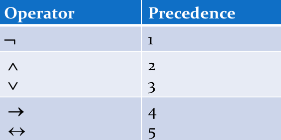
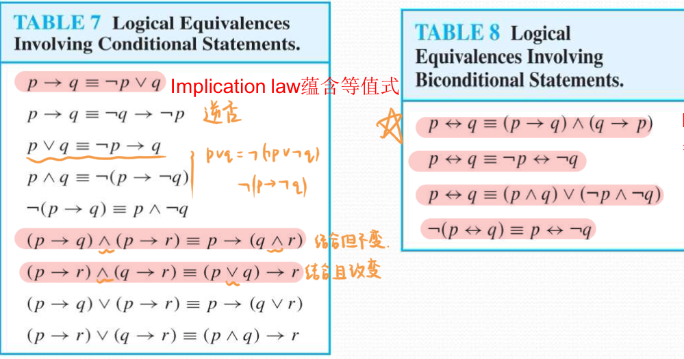
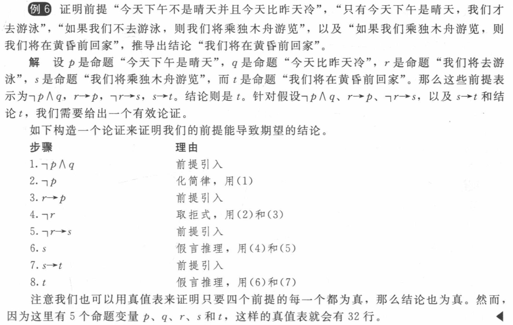
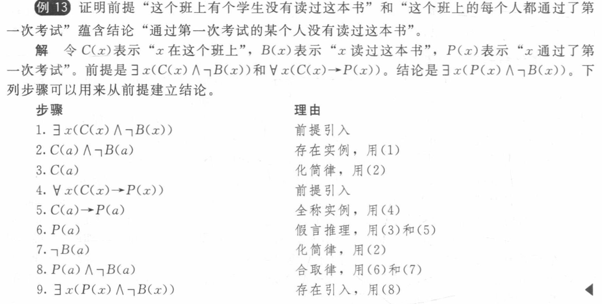

## English
|English|Chinese|English|Chinese|English|Chinese|
|:--:|:--:|:--:|:--:|:--:|:--:|
|theorem|定理|axiom|公理|lemma|引理|
|colollary|推论|conjecture|猜想|||

## 1.1 Propositional Logic
### 1.1.1 命题和命题逻辑
- 否定：Negation ¬ （NOT）
- 合取：Conjunction ∧ （AND）
- 析取：Disjunction/Inclusive or（兼或） ∨ （OR）
- 异或：Exclusive or ⊕ （XOR）
- 蕴含：Implication -> （IF-THEN）

    ??? abstract "不同的English表达"

        - if p,then q
        - p implies q
        - if p,q 
        - **p only if q**
        - **q unless ¬p**
        - q when p
        - q if p 
        - q whenever p 
        - p is sufficient for q （充分的）
        - q follows from p 
        - q is necessary for p （必要的）

    - 只有p为T，q为F时，p->q为F；其余情况为T
    - 推广的条件陈述：
      
        - 逆（converse）：q->p
        - 逆否（contrapositive）：¬q->¬p
        - 反（inverse）：¬p->¬q
        - 逆否=原命题，逆=反命题

- 双向蕴含：Biconditional <-> （IF AND ONLY IF）
    
    - 表达：
      
        - p if and only if q
        - p is necessary and sufficient for q
        - if p then q, and conversely
        - p iff q

    - p与q不同时，p<->q为F；相同时，为T

??? note "其余操作符"

    - 或非：Peirce arrow ↓（NOR）
    - 与非：Sheffer stroke ｜（NAND）
        - ¬p=p|p

### 1.1.2 真值表
- 运算顺序

    

## 1.2 Applications
- 翻译English为逻辑命题

## 1.3 Propositional Equivalences（命题等价式）
- 命题的分类
  
    - 永真式（tautology）：永远为T
    - 矛盾式（contradiction）：永远为F
    - 可能式（contingency）：T和F都有可能

- 逻辑等价 p⇔q or p≡q
  
    - 定义：p和q的真值相同
  
    ??? abstract "常见等价关系"
    
        - Morgen's Laws（摩根定律）
            - ¬(p∧q)≡¬p∨¬q
            - ¬(p∨q)≡¬p∧¬q
        - Identity Laws（恒等律）
            - p∧T≡p
            - p∨F≡p
        - Domination Laws（支配律）
            - p∨T≡T
            - p∧F≡F
        - Idempotent laws（幂等律）
            - p∨p≡p
            - p∧p≡p
        - Double Negation Law（双重否定律）:¬(¬p)≡p
        - Negation Laws（否定律）
            - p∨¬p≡T
            - p∧¬p≡F
        - Commutative Laws（交换律）
            - p∨q≡q∨p
            - p∧q≡q∧p
        - Associative Laws（结合律）
            - (p∧q)∧r≡p∧(q∧r)
            - (p∨q)∨r≡p∨(q∨r)
        - Distributive Laws（分配律）
            - (p∨(q∧r))≡(p∨q)∧(p∨r)
            - (p∧(q∨r))≡(p∧q)∨(p∧r)
        - Absorption Laws（吸收律）
            - p∨(p∧q)≡p
            - p∧(p∨q)≡p
        - More
            

- 对偶式（Dual）

    - 符号：$S^*$
    - 规则：交换∧和∨，交换T和F
    - 定理：S≡T if and only if $S^*≡T^*$

- Functionally complete operators：\{¬,∨\} ,\{¬,∧\} ,\{|\} ,\{↓\} 

- 可满足性（Propositional Satisfiability）：有真值为T

- 命题范式（Propositional Normal Forms）
    
    - 分类：
        
        - the disjunctive normal form(DNF) （析取范式）
            
            - e.g. (p∧q)∨(p∧¬q)
            
            !!! note "Notice!"
                ¬(p∧q)∨r不满足析取范式，前半部分不是文字的合取形式！

        - the conjunctive normal form(CNF) （合取范式）
        !!! note "Notice!"

            只有文字和只有子句的命题既是合取范式，又是析取范式！

            e.g. p，p∧¬q
    
    - 相关定义：
        
        - literal（文字）：一个变量或者其否定
        - clauses（子句）：只由文字构成
            - Conjunctive clause/basic product
            - Disjunctive clause/basic addition
        - Full disjunctive form（完全析取）：由最小项的析取构成
    
    - 根据真值表得到范式
        
        - 最小项（minterm）：文字的合取，得到析取范式，找真值表中的T
        - 最大项（maxterm）：文字的析取，得到合取范式，找真值表中的F
    
## 1.4 Predicates and Quantifier（谓词和量词）
- 量词
    - 全称量词：
        - For all/every/each/any/arbitrary $x$ , $P(x)$ 
        - All of $x$ , $P(x)$ 
        - Given any $x$ , $P(x)$ 
    - 存在量词：
        - For some $x$ , $P(x)$
        - There is an $x$ such that $P(x)$
        - There is at least one $x$ such that $P(x)$
    - 唯一性量词：
        - There is a unique $x$ such that $P(x)$
        - There is one and only one $x$ such that $P(x)$

??? note "常见公式"
    (1) \(\forall xP(x) \lor A\)  ≡   \(\forall x(P(x) \lor A)\)

    (2) \(\forall xP(x) \land A\)  ≡   \(\forall x(P(x) \land A)\)

    (3) \(\exists xP(x) \lor A\)  ≡   \(\exists x(P(x) \lor A)\)

    (4) \(\exists xP(x) \land A\)  ≡   \(\exists x(P(x) \land A)\)

    (5) \(\forall x(A \rightarrow P(x))\)  ≡   \(A \rightarrow \forall xP(x)\)

    (6) \(\exists x(A \rightarrow P(x))\)  ≡   \(A \rightarrow \exists xP(x)\)

    (7) \(\forall x(P(x) \rightarrow A)\)  ≡   \(\exists xP(x) \rightarrow A\)

    (8) \(\exists x(P(x) \rightarrow A)\)  ≡   \(\forall xP(x) \rightarrow A\)

## 1.5 Nested Quantifiers（嵌套量词）

## 1.6 Rules of Inference（推理规则）

??? note "命题的推理规则"
    

    | <b>推理规则</b> | <b>永真式</b> | <b>名称</b> |
    |----------------|----------------|------------|
    | $\dfrac{p \quad p \to q}{q}$ | $(p \land (p \to q)) \to q$ | 假言推理 |
    | $\dfrac{\neg q \quad p \to q}{\neg p}$ | $(\neg q \land (p \to q)) \to \neg p$ | 取拒式 |
    | $\dfrac{p \to q \quad q \to r}{p \to r}$ | $((p \to q) \land (q \to r)) \to (p \to r)$ | 假言三段论 |
    | $\dfrac{p \lor q \quad \neg p}{q}$ | $((p \lor q) \land \neg p) \to q$ | 析取三段论 |
    | $\dfrac{p}{p \lor q}$ | $p \to (p \lor q)$ | 附加律 |
    | $\dfrac{p \land q}{p}$ | $(p \land q) \to p$ | 化简律 |
    | $\dfrac{p \quad q}{p \land q}$ | $(p \land q) \to (p \land q)$ | 合取律 |
    | $\dfrac{p \lor q \quad \neg p \lor r}{q \lor r}$ | $((p \lor q) \land (\neg p \lor r)) \to (q \lor r)$ | 消解律 |

    

    
    e.g.

    

??? note "量化命题的推理规则"
    | **推理规则** | **名称** |
    |--------------|----------|
    | $\dfrac{\forall x\, P(x)}{P(c)}$   (任意 $c$) | 全称实例 |
    | $\dfrac{P(c)}{\forall x\, P(x)}$   ($c$ 是任意元素) | 全称引入 |
    | $\dfrac{\exists x\, P(x)}{P(c)}$   (对某个特定 $c$) | 存在实例 |
    | $\dfrac{P(c)}{\exists x\, P(x)}$   (对某个元素 $c$) | 存在引入 |

    e.g.

    

## 1.7～1.8 Proofs

