## English
|English|Chinese|English|Chinese|English|Chinese|
|:--:|:--:|:--:|:--:|:--:|:--:|
|bipartite|二分图|adjacency matrix|邻接矩阵|isomorphic|同构的|
|pseudograph|伪图|chromatic number|着色数|||

## 10.2 基础术语
- 定义：
    - 二分图（bipartite）：简单图分成不相交的两部分，每条边都连接这两部分
        
        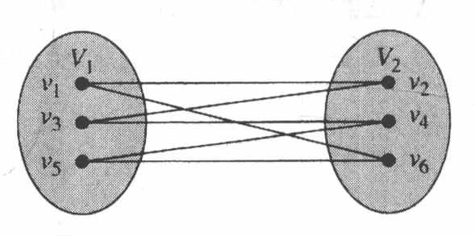

    - $N(A)$ ：图的顶点集的子集 $A$ 相邻的所有顶点组成的集合
    - 完全匹配：在二分图 \(G=(V, E)\) ，划分成 \((V_1, V_2)\) 情况下，若 \(V_1\) 中每个顶点都是匹配边的端点（即 \(V_1\) 中顶点都被匹配到），或者匹配边的数量 \(\vert M\vert\) 等于 \(V_1\) 集合顶点的数量 \(\vert V_1\vert\) ，则称匹配 \(M\) 是从 \(V_1\) 到 \(V_2\) 的完全匹配
    - 完全二分图 $K_{3,3}$
- 图的分类
    
    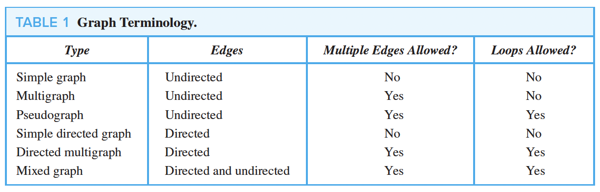

- 特殊的简单图
    - 完全图 $K_n$
        
        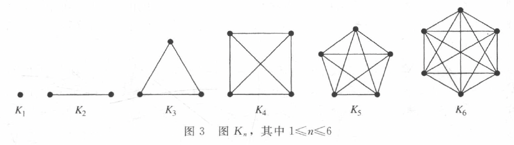
    
    - 圈图 $C_n$
        
        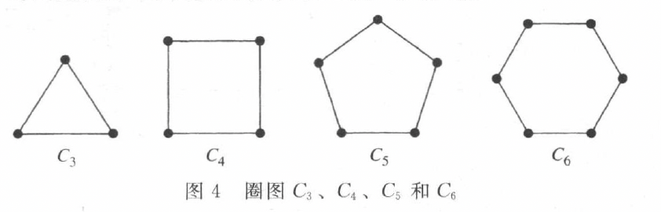
    
    - 轮图 $W_n$
        
        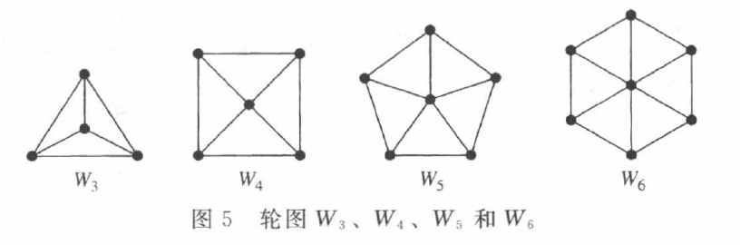
    
    - $n$ 立方体图 $Q_n$

        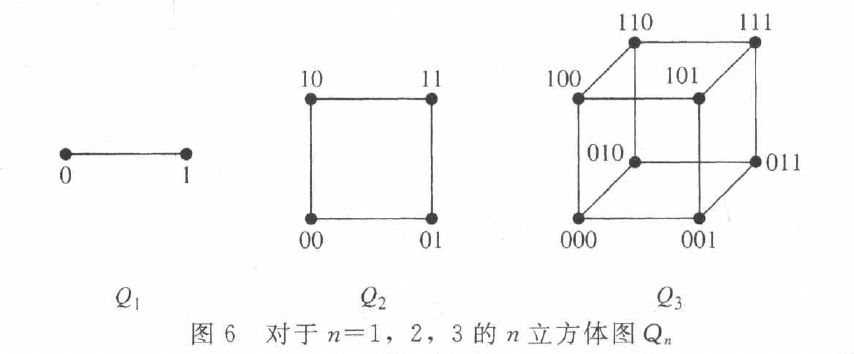

### 定理 霍尔婚姻定理
**完全匹配的充分必要条件**

带有二部划分 $(V_1, V_2)$ 的二分图 $G = (V, E)$ 中有一个从 $V_1$ 到 $V_2$ 的完全匹配当且仅当对于 $V_1$ 的所有子集 $A$ ，有 $|N(A)| \geq |A|$

## 10.3 图的表示和同构
关联矩阵？？

## 10.4 连通性
### 定理 1 顶点之间的通路数
设\(G\)是一个图，该图的邻接矩阵\(A\)相对于图中的顶点顺序\(v_1, v_2, \cdots, v_n\)（允许带有无向或有向边、带有多重边和环）。从\(v_i\)到\(v_j\)长度为\(r\)的不同通路的数目等于\(A^r\)的第\((i, j)\)项，其中\(r\)是正整数 

## 10.5 欧拉通路与哈密顿通路
### 10.5.1 Euler Path and Circuit（遍历边）
- 定义：
    - 欧拉通路
    - 欧拉回路
    - 欧拉图：具有欧拉回路的图
- 寻找欧拉回路的方法
    - 找到一条回路，原图中去掉该回路
    - 在去掉回路之后的图中重复上述操作

    ??? note "Example"
        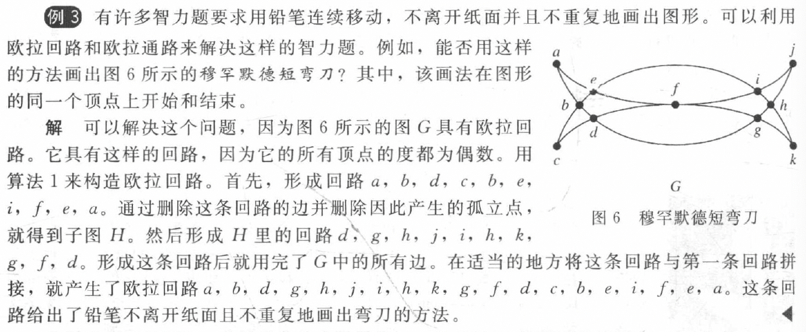

#### 定理 1 
含有至少2个顶点的连通多重图具有**欧拉回路**当且仅当它的每个顶点的度都为偶数
#### 定理 2
连通多重图**具有欧拉通路但无欧拉回路**当且仅当它恰有2个度为奇数的顶点
#### 定理 3 有向图（没有孤立点）
1. 有欧拉回路
   
   - 图为弱连通的
   - 每个顶点的出度和入度相同

2. 有欧拉通路但无欧拉回路
   
   - 图为弱连通的
   - 除了两个顶点外，其他所有顶点的入度和出度相等；两个顶点中一个顶点的入度比出度大1，另一个顶点的出度比入度大1 

### 10.5.2 Hamilton Path and Circuit（遍历点）
- 带有度为1的顶点的图没有哈密顿回路
- 对于\(n\)个顶点的完全图，哈密顿回路的数量为\((n - 1)!/2\)
#### 定理 1 狄拉克定理（充分）
如果 \(G\) 是有 \(n\) 个顶点的简单图，其中 \(n \geq 3\)，并且 \(G\) 中每个顶点的度都至少为 \(n/2\)，则 \(G\) 有**哈密顿回路**

#### 定理 2 欧尔定理（充分）
如果 \(G\) 是有 \(n\) 个顶点的简单图，其中 \(n \geq 3\)，并且对于 \(G\) 中每一对不相邻的顶点 \(u\) 和 \(v\) 来说，都有 \(\text{deg}(u) + \text{deg}(v) \geq n\)，则 \(G\) 有**哈密顿回路**

#### 定理 3 必要条件
若图 \(G\) 有**哈密顿回路** ，则对于顶点集 $V$ 的所有非空子集 $S$ ，$G-S$ 连通分量的数量小于等于 $|S|$

!!! note "Notice!"
    可以用来判断一个图无哈密顿回路

## 10.6 最短路径问题
### 弗洛伊德算法（Floyd）
- 可以求出加权连通简单图中所有顶点对之间的最短路径长度
- 不能用来构造最短通路

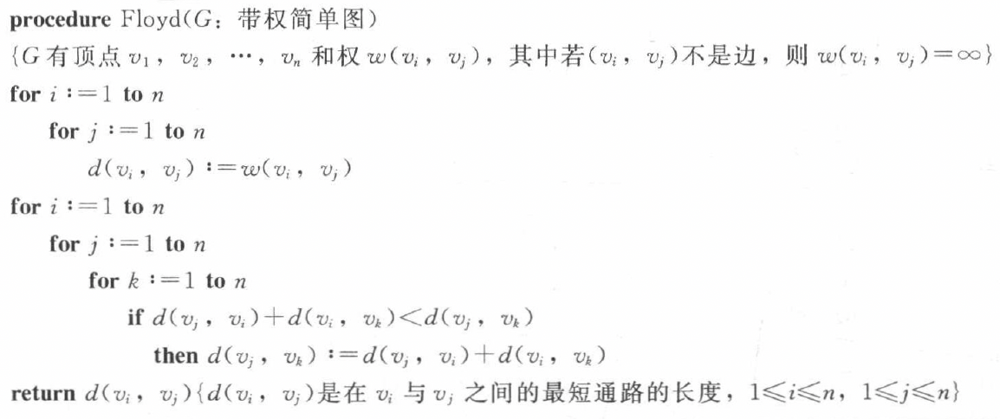

## 10.7 平面图（planar）
- 定义：
    - 平面图：在平面中画出一个图，边没有任何交叉
        
        ??? note "Example"
            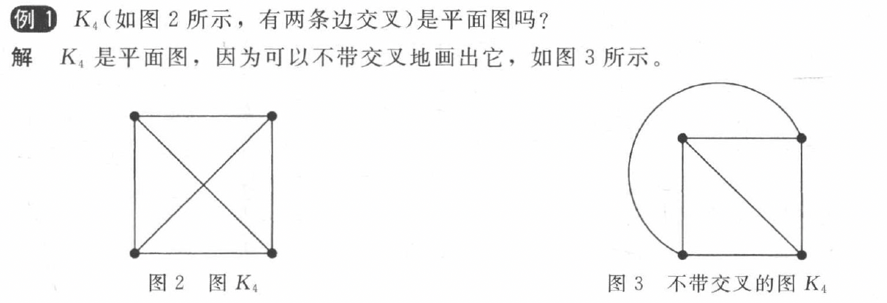

    - 面（region）

### 定理 1 欧拉公式
设 \(G\) 是带 \(e\) 条边和 \(v\) 个顶点的**连通**平面简单图。设 \(r\) 是 \(G\) 的平面图表示中的面数，则 \(r = e - v + 2\)

#### 推论 1
设 \(G\) 是带 \(e\) 条边和 \(v\) 个顶点的**连通**平面简单图，其中 \(v \geq 3\)，则 \(e \leq 3v - 6\)

#### 推论 2
若 \(G\) 是连通平面简单图，则 \(G\) 中有度数不超过 \(5\) 的顶点

#### 推论 3
若连通平面简单图有 \(e\) 条边和 \(v\) 个顶点，\(v\geq3\) 并且没有长度为 \(3\) 的回路，则 \(e\leq2v - 4\)

!!! note "Notice!"
    利用推论证明是否是平面图。

### 定理 2 库拉图斯基定理
- 定义
    - 同胚：两个图可以从一个相同的图通过初等细分得到，则这两个图同胚

        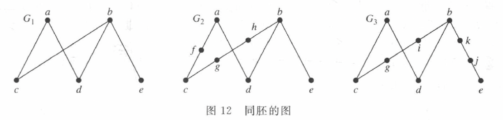

    - 初等细分

- 定理
    一个图是**非平面图**当且仅当它包含一个同胚于 \( K_{3,3} \)（完全二分图） 或 \( K_5 \) 的子图

    ??? note "Example"
        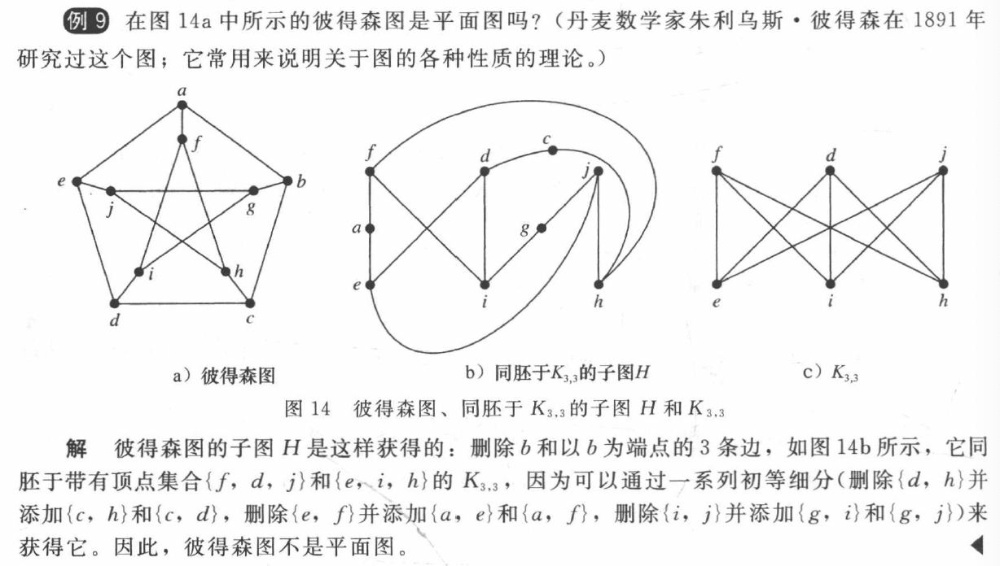

## 10.8 图着色
- 定义
    - 简单图的着色：对每个顶点指定颜色，每对相邻两个顶点的颜色不同
    - 图的着色数（chromatic number） $\chi(G)$：最少颜色数 

### 定理 1 四色定理
平面图的着色数不超过 \( 4 \)
### 常用结论
- $\chi(K_n) = n$
- $\chi(K_{m,n}) = 2$
- \[
    \chi(C_n) = 
    \begin{cases} 
    2, & \text{当 } n \text{ 为正偶数且 } n \geq 4 \text{ 时} \\
    3, & \text{当 } n \text{ 为正奇数且 } n \geq 3 \text{ 时}
    \end{cases}
    \]