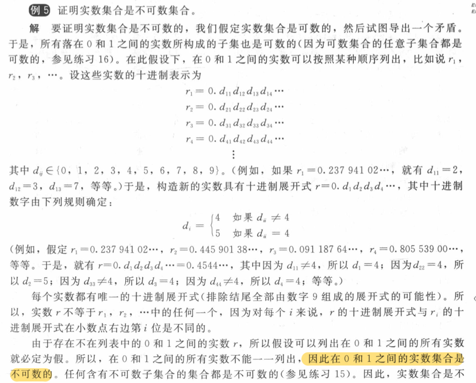

## English
|English|Chinese|English|Chinese|English|Chinese|
|:--:|:--:|:--:|:--:|:--:|:--:|
|cardinality|基数|subset|子集|one-to-one/injection|单射|
|onto/surjection|满射|one-to-one correspondence/bijection|双射|||

## 2.1 Sets
- 相关定义
    - 基数：集合的个数
    - 幂集 $\mathcal{P}(A)$ ： $A$ 集合所有子集组成的集合
    - 笛卡尔积：

        \[
        A_1 \times A_2 \times \cdots \times A_n = 
        \{(a_1, a_2, \ldots, a_n) \mid a_i \in A_i \text{ for } i=1, 2, \ldots, n\}
        \]

    - 真值集：使命题成立的所有元素组成的集合

## 2.2 Set Operations（集合运算）
- 对称集
    
    \[
    A \oplus B = (A \setminus B) \cup (B \setminus A)
    \]

## 2.3 Functions
 
## 2.4 Sequences and Summations

??? note "常用求和公式"
    | 和 | 闭形式 | 和 | 闭形式 |
    |----|--------|----|--------|
    | $\sum\limits_{k=0}^n ar^k$ $(r \neq 1)$ | $\frac{a(r^{n+1}-1)}{r-1}$ | $\sum\limits_{k=1}^n k^3$ | $\frac{n^2(n+1)^2}{4}$ |
    | $\sum\limits_{k=1}^n k$ | $\frac{n(n+1)}{2}$ | $\sum\limits_{k=0}^\infty x^k$ $(\|x\|<1)$ | $\frac{1}{1-x}$ |
    | $\sum\limits_{k=1}^n k^2$ | $\frac{n(n+1)(2n+1)}{6}$ | $\sum\limits_{k=1}^\infty kx^{k-1}$ $(\|x\|<1)$ | $\frac{1}{(1-x)^2}$ |

## 2.5 Cardinality of Sets
- 证明集合是可数集
    - 存在集合 $A$ 到 $Z^+$ 的函数为双射
    - 集合 $A$ 包含于一个可数集
    - 存在 $f:A->B$ 和 $g:B->A$ ，两者均为单射，则存在两个集合之间的双射函数
- 证明集合为不可数集
    - \* Cantor对角线法
    
    ??? note "Example"
        