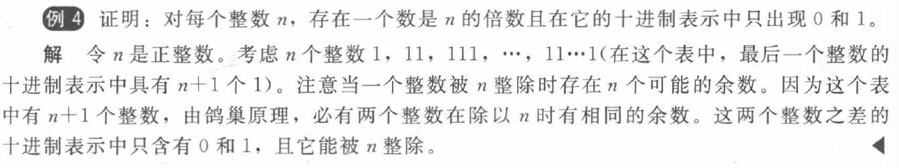
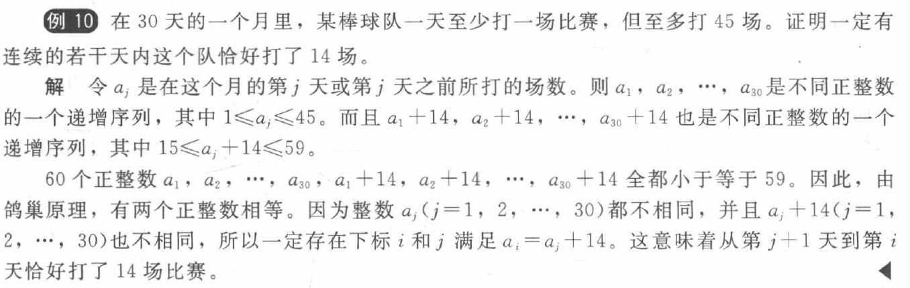
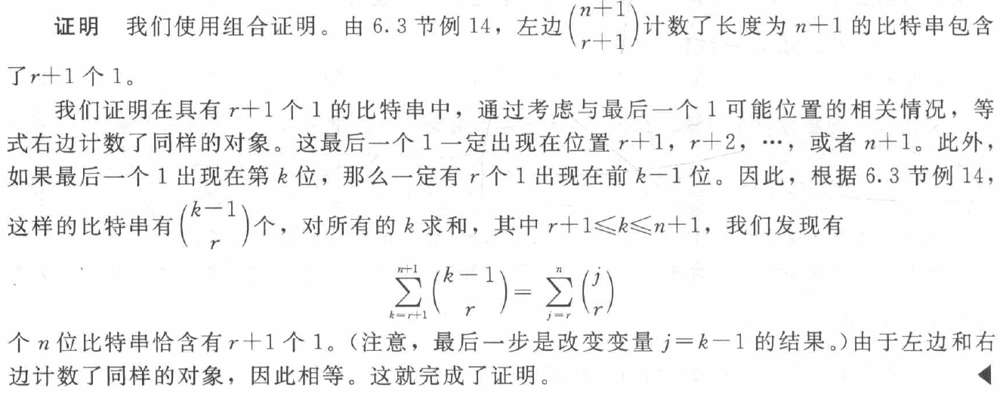
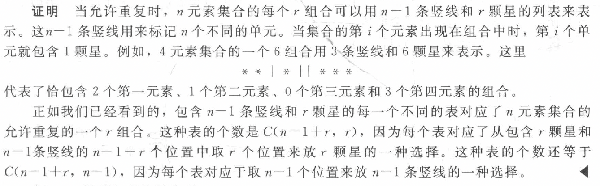
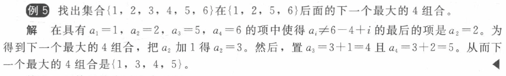

## English

|English|Chinese|English|Chinese|English|Chinese|
|:--:|:--:|:--:|:--:|:--:|:--:|
|permutations|排列|combinations|组合|||

## 6.2 鸽巢原理

### 定理 1 鸽巢原理
**狄利克雷抽屉原理（Pigeonhole Principle）**

如果 \(k + 1\) 个或更多的物体放入 \(k\) 个盒子，那么至少有一个盒子包含了2个或更多的物体。

### 定理 2 广义鸽巢原理
如果 \( N \) 个物体放入 \( k \) 个盒子，那么至少有一个盒子包含了至少 \(\lceil N/k \rceil\) 个物体。

### 定理 3
每个由 \( n^2 + 1 \) 个不同实数构成的序列都包含一个长为 \( n + 1 \) 的严格递增子序列或严格递减子序列。

### 拉姆齐理论
**拉姆齐数**   \( R(m, n) \)（其中 \( m \) 和 \( n \) 是大于或等于 2 的正整数）
表示：假设晚会上每两个人是朋友或者是敌人，那么在一个晚会上使得或者有 \( m \) 个人两两都是朋友，或者有 \( n \) 个人两两都是敌人所需要的最少人数。  

- 性质
    - \( R(m, n) = R(n, m) \)
    - \( R(2, n) = n\)

??? note "应用"
    
    
    

## 6.4 二项式定理

### 定理 1 帕斯卡恒等式  
设 \( n \) 和 \( k \) 是满足 \( n \geq k \) 的正整数，那么有  

\[
\binom{n+1}{k} = \binom{n}{k-1} + \binom{n}{k}
\]

### 定理 2 范德蒙德恒等式 
设 \( m, n \) 和 \( r \) 是非负整数，其中 \( r \) 不超过 \( m \) 或 \( n \)，那么  

\[
\binom{m+n}{r} = \sum_{k=0}^{r} \binom{m}{r-k} \binom{n}{k}
\]

### 定理 3  
设 \( n \) 和 \( r \) 是非负整数，\( r \leq n \)，那么  

\[
\binom{n+1}{r+1} = \sum_{j=r}^{n} \binom{j}{r}
\]

??? note "证明"
    

### 推论 1  
设 \( n \) 是非负整数，那么  

\[
\sum_{k=0}^n 2^k \binom{n}{k} = 3^n
\]

### 推论 2  
如果 \( n \) 是一个非负整数，那么  

\[
\binom{2n}{n} = \sum_{k=0}^{n} \binom{n}{k}^2
\]

## 6.5 排列与组合的推广
### 定理 1 允许重复的组合
\( n \) 个元素的集合中允许重复的 \( r \) 组合有 \( C(n+r-1, r) = C(n+r-1, n-1) \) 个。

**注：**用来求从 $n$ 种元素的集合中选择 $r$ 个元素的方法数

??? note "证明"
    

### 定理 2 允许重复的排列
\( n \) 个元素的集合中允许重复的 \( r \) 排列数是 $n^r$ 。

### 应用 把物体放入盒子
- **可辨别的物体与可辨别的盒子**

    把 \( n \) 个不同的物体分配到 \( k \) 个不同的盒子使得 \( n_i \) 个物体放入盒子 \( i \) (\( i=1,2,\cdots,k \)) 的方式数等于：

    \[
    \frac{n!}{n_1! n_2! \cdots n_k!}
    \]

- **不可辨别的物体与可辨别的盒子**

    有 \( C(n+r-1, n-1) \) 种方法将 \( r \) 个不可辨别的球放入 \( n \) 个可辨别的盒子

- **可辨别的物体与不可辨别的盒子**

    将 \( n \) 个不可辨别的物体放入 \( k \) 个可辨别的盒子的方法数等于：
        
    \[ 
    \sum_{j=1}^{k} S(n,j) = \sum_{j=1}^{k} \frac{1}{j!} \sum_{i=0}^{j-1} (-1)^i \binom{j}{i} (j-i)^n 
    \]

    !!! note "Notice!"
        **第二类斯特林数 \( S(n, j) \)**
        
        表示将 \( n \) 个可辨别的物体放入 \( j \) 个不可辨别的盒子的方式数（不允许空盒）

- **不可辨别的物体与不可辨别的盒子**
    
    枚举得到结果

## 6.6 生成排列和组合
- **生成排列**

    以字典顺序为基础

- **生成组合**

    ??? note "Example"
        

## 扩展：斯特林数
