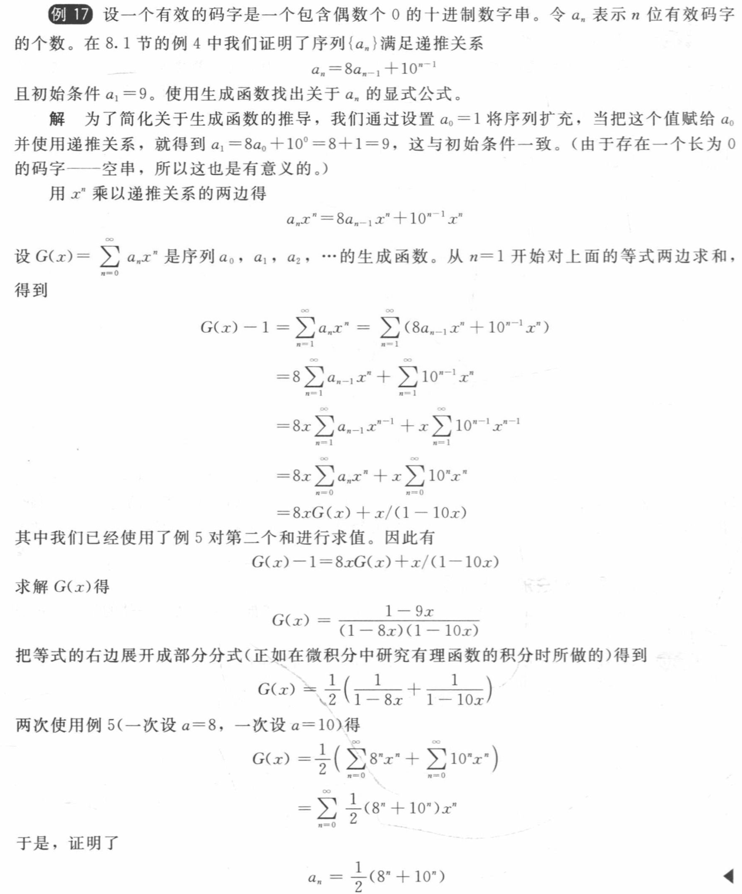
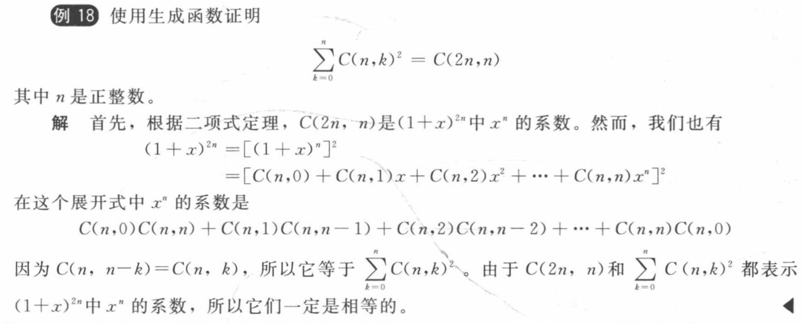

## 8.2 求解线性递推关系
### 8.2.1 齐次递推关系
#### 定理 1 有两相异实根的二阶方程  
设 \( c_1 \) 和 \( c_2 \) 为实数，特征方程 \( r^2 - c_1 r - c_2 = 0 \) 有两个相异实根 \( r_1 \) 和 \( r_2 \)。则递推关系

\[ 
a_n = c_1 a_{n-1} + c_2 a_{n-2} 
\]

的通解为： 

\[
a_n = \alpha_1 r_1^n + \alpha_2 r_2^n \quad (n \geq 0) 
\]  

其中 \( \alpha_1, \alpha_2 \) 为常数。

#### 定理 2 重根的二阶方程  
设 \( c_1, c_2 \) 为实数且 \( c_2 \neq 0 \)，若特征方程 \( r^2 - c_1 r - c_2 = 0 \) 有唯一根 \( r_0 \)。则递推关系  

\[ 
a_n = c_1 a_{n-1} + c_2 a_{n-2} 
\]  

的通解为：  

\[ 
a_n = (\alpha_1 + \alpha_2 n) r_0^n \quad (n \geq 0) 
\]

其中 \( \alpha_1, \alpha_2 \) 为常数。

#### 定理 3 无重根的k阶差分方程  
设 \( c_1, c_2, \dots, c_k \) 为实数，若特征方程 

\[ 
r^k - c_1 r^{k-1} - \dots - c_k = 0 
\]

有 \( k \) 个相异根 \( r_1, r_2, \dots, r_k \)。则递推关系 

\[ 
a_n = \sum_{i=1}^k c_i a_{n-i} 
\]

的通解为：  

\[ 
a_n = \sum_{i=1}^k \alpha_i r_i^n \quad (n \geq 0) 
\]

其中 \( \alpha_i \) 为常数。

#### 定理 4 有重根的k阶差分方程
设特征方程有 \( t \) 个相异根 \( r_1, \dots, r_t \)，其重数分别为 \( m_1, \dots, m_t \)（满足 \( \sum m_i = k \)）。则对应递推关系的通解为：  

\[ 
a_n = \sum_{i=1}^t \left( \sum_{j=0}^{m_i-1} \beta_{i,j} n^j \right) r_i^n 
\]

其中 \( \beta_{i,j} \) 为常数。

### 8.2.2 非齐次递推关系

#### 定理 5 非齐次方程解的结构
若 \( \{a_n^{(p)}\} \) 是非齐次递推关系  

\[ 
a_n = \sum_{i=1}^k c_i a_{n-i} + F(n) 
\]

的特解，则其通解可表示为：  

\[ 
a_n = a_n^{(p)} + a_n^{(h)} 
\]

其中 \( a_n^{(h)} \) 为对应齐次方程的通解。

#### 定理 6 非齐次方程特解形式  
当非齐次项 \( F(n) = (b_t n^t + \dots + b_0)s^n \) 时：  
1. 若 \( s \) 不是特征根，特解形式为：  
    
\[ 
(p_t n^t + \dots + p_0)s^n 
\]

2. 若 \( s \) 是 \( m \) 重特征根，特解形式为：  
    
\[ 
n^m (p_t n^t + \dots + p_0)s^n 
\]

其中 \( p_i \) 为待定系数。

## 8.3 Divide-and Conquer Algorithm (分而治之)
### 定理 1 
设\(f\)是满足递推关系

\[
f(n) = af(n/b) + c
\]

的增函数，其中\(n\)被\(b\)整除，\(a \geq 1\)，\(b\)是大于\(1\)的整数，\(c\)是一个正实数。那么

\[
f(n) \text{ 是 } 
\begin{cases}
O(n^{\log_b a}) & a > 1 \\
O(\log n) & a = 1
\end{cases}
\]

而且，当\(n = b^k\)（其中\(k\)是正整数），\(a \neq 1\)时

\[
f(n) = C_1 n^{\log_b a} + C_2
\]

其中 \(C_1 = f(1) + c/(a - 1)\) 且 \(C_2 = -c/(a - 1)\)。 

### 定理 2 主定理 
设\(f\)是满足递推关系

\[
f(n) = af(n/b) + cn^d
\]

的增函数，其中**\(n = b^k\)**，\(k\)是一个正整数，\(a \geq 1\)，\(b\)是大于\(1\)的整数，\(c\)和\(d\)是实数，满足\(c\)是正的且\(b\)是非负的。那么

\[
f(n) \text{ 是 } 
\begin{cases}
O(n^d) & a < b^d \\
O(n^d \log n) & a = b^d \\
O(n^{\log_b a}) & a > b^d
\end{cases}
\] 

## 8.4 Generating Functions (生成函数)
### 定义 1 普通生成函数
实数序列\(a_0, a_1, \cdots, a_k, \cdots\)的生成函数是无穷级数：

\[
G(x) = a_0 + a_1x + \cdots + a_kx^k + \cdots = \sum_{k = 0}^{\infty} a_kx^k
\] 
### 定义 2 广义二项式系数
设\(u\)是实数且\(k\)是非负整数。那么广义二项式系数\(\binom{u}{k}\)定义为

\[
\binom{u}{k}= 
\begin{cases}
\frac{u(u - 1)\cdots(u - k + 1)}{k!} & k > 0 \\
1 & k = 0
\end{cases}
\]

### 定理 1 
令\(f(x) = \sum_{k = 0}^{\infty} a_k x^k\)，\(g(x) = \sum_{k = 0}^{\infty} b_k x^k\)，那么

\[
f(x) + g(x) = \sum_{k = 0}^{\infty} (a_k + b_k)x^k \text{ 和 } f(x)g(x) = \sum_{k = 0}^{\infty} \left(\sum_{j = 0}^{k} a_j b_{k - j}\right)x^k
\]

### 定理 2 广义二项式定理 
设\(x\)是实数，\(\vert x \vert < 1\)，\(u\)是实数，那么

\[
(1 + x)^u = \sum_{k = 0}^{\infty} \binom{u}{k} x^k
\] 

??? note "常用结论"
    - $\binom{-n}{r}=(-1)^rC(n + r - 1,r)$

        proof:

        \[
        \begin{align*}
        \binom{-n}{r}&=\frac{(-n)(-n - 1)\cdots(-n - r + 1)}{r!} & \text{由广义二项系数定义}\\
        &=\frac{(-1)^r n(n + 1)\cdots(n + r - 1)}{r!} & \text{从分子的每一项中提取因子}-1\\
        &=\frac{(-1)^r (n + r - 1)(n + r - 2)\cdots n}{r!} & \text{由乘法的交换律}\\
        &=\frac{(-1)^r (n + r - 1)!}{r!(n - 1)!} & \text{分子和分母同时乘以}(n - 1)!\\
        &=(-1)^r\binom{n + r - 1}{r} & \text{由二项系数的定义}\\
        &=(-1)^rC(n + r - 1,r) & \text{使用另外一种二项系数符号表示}
        \end{align*}
        \] 

??? note "常用生成函数表"

    | 生成函数 \( G(x) \)                     | 系数 \( a_k \)（\( x^k \) 项系数）               |
    |----------------------------------------|------------------------------------------------|
    | \( (1 + x)^n = \sum_{k=0}^n C(n, k)x^k \) | \( C(n, k) \)（组合数）                         |
    | \( (1 + ax)^n = \sum_{k=0}^n C(n, k)a^k x^k \) | \( C(n, k)a^k \)                               |
    | \( (1 + x^r)^n = \sum_{k=0}^n C(n, k)x^{rk} \) | \( C(n, k/r) \)（若 \( r \mid k \)）；否则 0    |
    | \( \frac{1 - x^{n+1}}{1 - x} = \sum_{k=0}^n x^k \) | 1（若 \( k \leq n \)）；否则 0                 |
    | \( \frac{1}{1 - x} = \sum_{k=0}^\infty x^k \) | 1（所有 \( k \geq 0 \)）                       |
    | \( \frac{1}{1 - ax} = \sum_{k=0}^\infty a^k x^k \) | \( a^k \)                                      |
    | \( \frac{1}{1 - x^r} = \sum_{k=0}^\infty x^{rk} \) | 1（若 \( r \mid k \)）；否则 0                 |
    | \( \frac{1}{(1 - x)^2} = \sum_{k=0}^\infty (k + 1)x^k \) | \( k + 1 \)（线性增长）                        |
    | \( \frac{1}{(1 - x)^n} = \sum_{k=0}^\infty C(n + k - 1, k)x^k \) | \( C(n + k - 1, k) \)（多重组合数）            |
    | \( \frac{1}{(1 + x)^n} = \sum_{k=0}^\infty (-1)^k C(n + k - 1, k)x^k \) | \( (-1)^k C(n + k - 1, k) \)（交错多重组合数） |
    | \( \frac{1}{(1 - ax)^n} = \sum_{k=0}^\infty C(n + k - 1, k)a^k x^k \) | \( C(n + k - 1, k)a^k \)                       |
    | \( e^x = \sum_{k=0}^\infty \frac{x^k}{k!} \) | \( \frac{1}{k!} \)（指数函数系数）             |
    | \( \ln(1 + x) = \sum_{k=1}^\infty \frac{(-1)^{k+1}}{k}x^k \) | \( \frac{(-1)^{k+1}}{k} \)（对数函数系数）     |

### 应用
1. 使用生成函数求解递推关系
    - 步骤：
        - 先根据递推关系找到序列所对应的生成函数与 $x$ 的关系式
        - 将生成函数做幂级数展开，并可合成一个幂级数
        - 根据生成函数的幂级数形式得到 $a_n$ 的显式公式
   
    ??? note "Example"
        
        
2. 计数问题
    - 步骤：
        - 将每种物品的情况分别列成生成函数，分别求和
        - 生成函数相乘并且化为最简
        - 展开为幂级数，求所需指数项的系数
  
    ??? note "Example"

        **Question:**

        从三种甜甜圈（鸡蛋味、咸味、原味）中选择一打（12个），满足以下条件：
          - 每种甜甜圈至少选2个
          - 咸味甜甜圈不超过3个
        
        **Answer:**

        **总生成函数：**

        \[
        G(x) = \left( \frac{x^2}{1 - x} \right) \cdot (x^2 + x^3) \cdot \left( \frac{x^2}{1 - x} \right) = \frac{x^6 (1 + x)}{(1 - x)^2}
        \]

        我们需要找到 \( G(x) \) 展开式中 \( x^{12} \) 的系数，即：

        \[
        [x^{12}] \frac{x^6 (1 + x)}{(1 - x)^2} = [x^{6}] \frac{1 + x}{(1 - x)^2}
        \]

        （因为提取 \( x^6 \) 后，剩余部分需要贡献 \( x^6 \)）

        利用生成函数的展开公式：

        \[
        \frac{1}{(1 - x)^2} = \sum_{n=0}^{\infty} (n + 1) x^n
        \]

        因此：

        \[
        \frac{1 + x}{(1 - x)^2} = (1 + x) \sum_{n=0}^{\infty} (n + 1) x^n = \sum_{n=0}^{\infty} (n + 1) x^n + \sum_{n=0}^{\infty} (n + 1) x^{n + 1}
        \]

        合并同类项：

        \[
        = \sum_{n=0}^{\infty} (n + 1) x^n + \sum_{n=1}^{\infty} n x^n = 1 + \sum_{n=1}^{\infty} (2n + 1) x^n
        \]

        我们需要 \( x^6 \) 的系数：

        \[
        [x^6] \frac{1 + x}{(1 - x)^2} = 2 \times 6 + 1 = 13
        \]

3. 证明恒等式
  
    ??? note "Example"
        

## 8.5 The Principle of Inclusion-Enclusion (容斥原理)
### 定理 容斥原理
设 $A_1, A_2, \cdots, A_n$ 是有穷集。那么

\[
|A_1 \cup A_2 \cup \cdots \cup A_n| = 
\sum_{1 \leq i \leq n} |A_i| 
- \sum_{1 \leq i < j \leq n} |A_i \cap A_j|
\]

\[
+ \sum_{1 \leq i < j < k \leq n} |A_i \cap A_j \cap A_k| 
- \cdots 
+ (-1)^{n+1} |A_1 \cap A_2 \cap \cdots \cap A_n|
\]

## 8.6 容斥原理的应用
### 定理 1 映上函数的个数
设 $m$ 和 $n$ 是正整数，满足 $m \geq n$。那么存在

\[
n^m - C(n, 1)(n-1)^m + C(n, 2)(n-2)^m - \cdots + (-1)^{n-1}C(n, n-1) \cdot 1^n
\]

个从 $m$ 元素集合到 $n$ 元素集合的映上函数

### 定理 2 错位排列
$n$ 元素集合的错位排列数是  

\[
D_n = n! \left[ 1 - \frac{1}{1!} + \frac{1}{2!} - \frac{1}{3!} + \cdots + (-1)^n \frac{1}{n!} \right]
\]

## 扩展：Catalan数