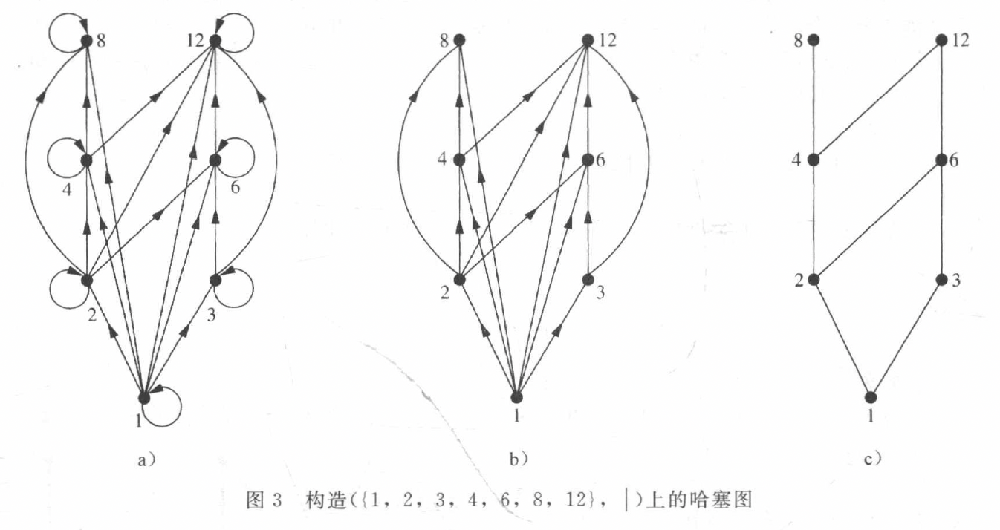
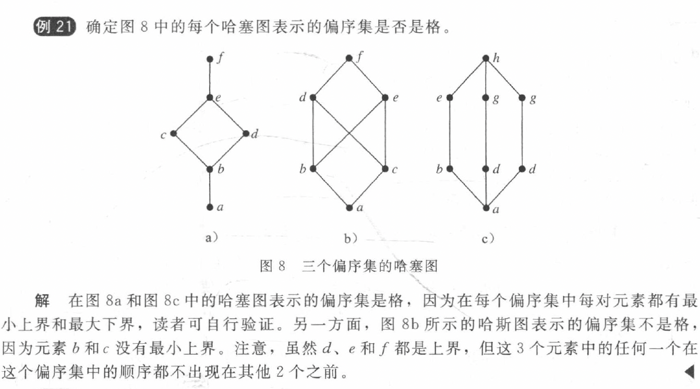

## English
|English|Chinese|English|Chinese|English|Chinese|
|:--:|:--:|:--:|:--:|:--:|:--:|
|reflexive|自反的|symmetric|对称的|antisymmetric|反对称的|
|partition|划分|partial order|偏序|poset|偏序集|
|total/linear order|全序/线序|well-ordered set|良序集|lexicographic order|字典顺序|
|Hasse diagram|哈塞图|||||

## 9.1 Relation
### 关系的性质
1. Reflexive（自反的）
2. Symmetric（对称的）
    
    如果 $(x,y)$ 在关系中，则 $(y,x)$ 也在关系中.

3. Antisymmetric（反对称的）
    
    如果 $(x,y)$ 在关系中并且 $(y,x)$ 也在关系中，则 $x=y$ .

4. Transitive（传递的）
    
    如果 $(x,y)$ 在关系中并且 $(y,z)$ 也在关系中，则 $(x,z)$ 在关系中.

!!! note "Notice!"
    如果关系是对称的并且是传递的，推不出来关系是自反的（如果关系中不存在任何元素）

### 定理 1
集合 $A$ 上的关系 $R$ 是传递的，当且仅当 $R^n \subseteq R$.

## 9.3 关系的表示
### 9.3.1 矩阵
1. 表示方法

- 有关系则为1，无关系则为0
- 行表示前边的集合，列表示后边的集合

2. 关系的性质
   
- 矩阵对称，则关系为对称的
- 矩阵对角线均为1，则关系为自反的
- 矩阵关于对角线对称的元素互异或者都为0，则关系为反对称的

### 9.3.2 图
- 自反性：所有点都有自环
- 非自反性：所有点都无自环
- 对称性：所有边双向
- 反对称性：无双向边（除自环）
- 传递性：检查所有路径是否闭合

## 9.4 closure（关系的闭包）
- 定义：
    - 闭包：集合 $A$ 上的关系 $R$ 的具有性质 $P$ 的闭包为集合 $A$ 上的包含 $R$ 的具有性质 $P$ 的关系 $S$
    

### 定理 1
设 \(R\) 是集合 \(A\) 上的关系。从 \(a\) 到 \(b\) 存在一条长为 \(n\)（\(n\)为正整数）的路径，当且仅当 \((a, b) \in R^n\) .
### 定理 2 
关系 $R$ 的传递闭包等于连通性关系 $R^*$ 
### 定理 3 传递闭包的矩阵
设 \(\boldsymbol{M}_R\) 是定义在 \(n\) 个元素集合上的关系 \(R\) 的 \(0 - 1\) 矩阵。那么传递闭包 \(R^*\) 的 \(0 - 1\) 矩阵是

\[
\boldsymbol{M}_{R^*} = \boldsymbol{M}_R \vee \boldsymbol{M}_R^{[2]} \vee \boldsymbol{M}_R^{[3]} \vee \cdots \vee \boldsymbol{M}_R^{[n]}
\] 

### Warshall 算法求传递闭包
1. **初始化矩阵**：将关系 \( R \) 表示为邻接矩阵 \( M \)，其中 \( M[i][j] = 1 \) 表示 \( (i, j) \in R \)，否则为 0
2. **迭代更新**：对于每个中间顶点 \( k \)，检查是否存在路径 \( i \to k \to j \)。如果存在，则设置 \( M[i][j] = 1 \)；第 $x$ 次检查包含前 $x$ 个顶点的路径
3. **终止条件**：处理完所有中间顶点后，矩阵 \( M \) 即为传递闭包的矩阵表示

!!! note "Notice!"
    - 新设置的路径可以用于后续路径的检查！
    - e.g. P560 例8
    
## 9.5 等价关系
- 定义
    - 等价关系：如果一个关系是自反的、对称的和传递的
    - 等价类：$R$ 是 $A$ 上的等价关系，所有与元素 $a$ 有关系的元素的集合叫做 $a$ 的等价类，记作 $[a]$
    - 划分：集合 $S$ 的划分为其不相交的非空子集构成的集合，并且他们的并集为 $S$
### 定理 1
设\(R\)是定义在集合\(A\)上的等价关系，下面的关于集合\(A\)中\(a\)、\(b\)两个元素的命题是等价的

(i) \(aRb\)

(ii) \([a]=[b]\)

(iii) \([a]\cap [b]\neq\varnothing\)
### 定理 2
设\(R\)是定义在集合\(S\)上的等价关系，那么\(R\)的等价类构成\(S\)的划分

反过来，给定集合\(S\)的划分\(\{A_i\mid i\in I\}\)，则存在一个等价关系\(R\)，它以集合\(A_i (i\in I)\)作为它的等价类

## 9.6 偏序（poset）
- 定义
    - 偏序：如果一个关系是自反的、反对称的和传递的
    - 偏序集 $(S,R)$ ：集合 $S$ 与定义在其上的偏序 $R$ 
    - 可比/不可比：偏序集 $(S,\preceq)$ 中的元素 $a$ 和 $b$ 称为**可比的**，如果 $a \preceq b$ 或 $b \preceq a$；当 $a$ 和 $b$ 是 $S$ 中的元素并且既没有 $a \preceq b$，也没有 $b \preceq a$，则称 $a$ 与 $b$ 是**不可比的**
    - 如果 $(S,\preceq)$ 是偏序集，且 $S$ 中的每对元素都是可比的，则 $S$ 称为**全序集**或**线序集**，且 $\preceq$ 称为全序或线序。一个全序集也称为**链**
    - 对于偏序集 $(S,\preceq)$，如果 $\preceq$ 是全序，并且 $S$ 的每个非空子集都有一个最小元素，就称它为**良序集**
### 9.6.1 字典顺序（笛卡尔积上的字典序）

在两个偏序集 $(A_1,\preceq_1)$ 和 $(A_2,\preceq_2)$ 的笛卡尔积上构造一个偏序。

在 $A_1 \times A_2$ 上的**字典顺序**定义如下：

$$
(a_1, a_2) \prec (b_1, b_2) \iff 
\begin{cases} 
a_1 \prec_1 b_1, & \text{or} \\
a_1 = b_1 and a_2 \prec_2 b_2.
\end{cases}
$$
### 9.6.2 哈塞图构建
1. 去掉所有自环
2. 去掉由于传递性出现的边
3. 假设所有的边的方向是向上的，去掉边的方向

### 9.6.3 极大元和极小元
- 极大/小元
- 最大/小元
- 上界/下界：大于等于偏序集的子集 $A$ 中的所有元素的元素为子集 $A$ 的上界
- 最小上界/最大下界：上界中小于其他上界的元素

### 9.6.4 格（lattices）
- 定义：一个偏序集的每对元素都有最小上界和最大上界

??? note "判断偏序是否是格"
    
